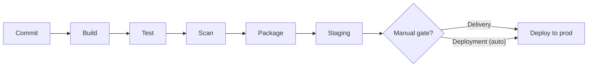

# CI/CD

> Automating the path from a code change to a running release — integrating and testing every change (CI), then delivering or deploying it (CD) — through a repeatable pipeline.

---

## What is it?

CI/CD is the practice of automating everything between "a developer commits code" and "that code is running in production." It has three related parts:

- **Continuous Integration (CI)** — every change is merged into a shared branch frequently, and each merge is automatically **built and tested**. The goal is to catch integration problems within minutes, not weeks.
- **Continuous Delivery (CD)** — every change that passes CI is automatically prepared for release, so a production deploy is always **one button press** away.
- **Continuous Deployment (CD)** — goes one step further: every change that passes the pipeline is deployed to production **automatically**, with no manual gate.

The automated sequence of steps that carries a change through these stages is called a **pipeline**.

## Why does it matter?

Integrating code manually and infrequently is where large, painful "merge hell" comes from: branches drift apart for weeks, then collide. CI keeps everyone's work continuously merged and verified, so conflicts stay small.

On the delivery side, manual deployments are slow, inconsistent, and dependent on one person who "knows the steps." Automating them makes releases **repeatable and boring** — which is exactly what you want. Small, frequent, automated releases are less risky than large, rare, manual ones: less changes per release means a smaller blast radius and an easier rollback. This is the engine that makes [DevOps](devops.md) flow work.

## How it works

A pipeline is a sequence of **stages**, each made of **steps**, triggered by an event — usually a push or a pull request. If any stage fails, the pipeline stops and reports back, so a broken change never reaches the next stage.



- **Build** — compile the code, produce an artifact (often a [container image](containers.md)).
- **Test** — run unit, integration, and end-to-end tests.
- **Scan** — static analysis, dependency and security scanning, code-quality gates.
- **Package** — publish the versioned artifact to a registry.
- **Deploy** — roll the artifact out to an environment, often using a [deployment strategy](deployment-strategies.md).

The distinction between **delivery** and **deployment** is just whether a human approves the final step. Everything before it is identical.

## Examples

A pipeline expressed as configuration lives **in the repository** next to the code it builds. A GitHub Actions workflow:

```yaml
name: ci
on: [push, pull_request]

jobs:
  build-test:
    runs-on: ubuntu-latest
    steps:
      - uses: actions/checkout@v4
      - run: npm ci
      - run: npm test           # fail the pipeline if tests fail
      - run: npm run build

  deploy:
    needs: build-test           # only runs if build-test passed
    if: github.ref == 'refs/heads/main'
    runs-on: ubuntu-latest
    steps:
      - run: ./scripts/deploy.sh
```

Because the pipeline definition is versioned with the code, the build process changes atomically with the code that needs it.

## When to use

- Any project with more than one contributor, where changes must integrate cleanly.
- Products that release regularly and want each release to be low-risk.
- Codebases with a meaningful test suite that should gate every change.
- Teams practicing trunk-based development or short-lived feature branches.

## When NOT to use

- **Full continuous *deployment*** without a mature test suite and monitoring — auto-shipping unverified changes to production is reckless; start with delivery and a manual gate.
- A solo throwaway prototype where pipeline setup costs more than it saves.
- As a substitute for tests: a green pipeline that runs no meaningful tests gives false confidence.

## References

- Jez Humble, David Farley — *Continuous Delivery*
- [Martin Fowler — Continuous Integration](https://martinfowler.com/articles/continuousIntegration.html)
- [Atlassian — CI/CD](https://www.atlassian.com/continuous-delivery/principles/continuous-integration-vs-delivery-vs-deployment)
