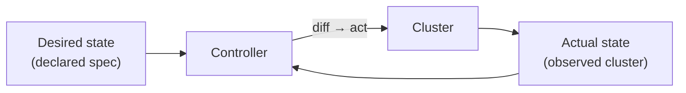

# Container Orchestration

> Automating the deployment, scaling, networking, and health of containers across a cluster of machines, driven by a declared desired state.

---

## What is it?

Container orchestration is the layer that runs containers **at scale**. Once you have more than a handful of containers spread across several machines, someone has to decide which container runs on which host, restart the ones that crash, replace the ones on a failed machine, route traffic to them, and scale their number up and down. An orchestrator does all of that automatically.

You describe **what** you want — "run 5 replicas of this image, expose it on port 80, keep it healthy" — and the orchestrator continuously works to make reality match that description. [Kubernetes](../orchestration/kubernetes.md) is the dominant example.

## Why does it matter?

A single container is easy to run by hand. A hundred containers across a dozen servers is not. Machines fail, traffic spikes, images get updated, and doing any of this manually is slow and error-prone.

Orchestration turns a fleet of servers into a single logical pool of resources. It gives you **self-healing** (crashed containers are restarted, dead nodes are drained), **elastic scaling** (add replicas under load, remove them when idle), **zero-downtime deployments** (roll out new versions gradually), and **service discovery** (containers find each other by name, not by IP). Without it, these become bespoke scripts that every team reinvents and maintains.

## How it works

Orchestrators are built on a **reconciliation loop** driven by a **desired state**. You submit a declarative spec to a control plane; a controller compares desired state to the actual state and takes action to close the gap. This loop never stops — if a container dies an hour later, the loop notices the drift and replaces it.



The core responsibilities of an orchestrator:

- **Scheduling** — place each container on a node with enough CPU/memory that satisfies its constraints.
- **Self-healing** — restart failed containers; reschedule the containers of a dead node elsewhere.
- **Scaling** — change the number of replicas manually or automatically based on metrics.
- **Service discovery & load balancing** — give a stable name/address to a changing set of container instances and spread traffic across them.
- **Rollouts & rollbacks** — update to a new image gradually and revert if it misbehaves (see [deployment strategies](deployment-strategies.md)).
- **Configuration & secrets** — inject config and credentials without baking them into images.

## Examples

A declarative desired state (Kubernetes-style): "keep 3 copies of this image running."

```yaml
apiVersion: apps/v1
kind: Deployment
metadata:
  name: web
spec:
  replicas: 3                # desired state: 3 running copies
  selector:
    matchLabels: { app: web }
  template:
    metadata:
      labels: { app: web }
    spec:
      containers:
        - name: web
          image: my-api:1.0
          ports:
            - containerPort: 8080
```

If a node hosting one replica crashes, the observed count drops to 2. The controller sees `desired=3, actual=2` and schedules a replacement — no human involved. Scaling is just editing one number:

```bash
kubectl scale deployment/web --replicas=10
```

## When to use

- Running many containers across multiple machines that must stay available.
- Workloads that need automatic recovery, autoscaling, or rolling updates.
- Microservice architectures where services must discover and talk to each other.
- Platforms serving production traffic with uptime requirements.

## When NOT to use

- A single app on a single server — a container runtime or [Docker Compose](../containerization/docker-compose.md) is far simpler and enough.
- Small teams without the capacity to operate a cluster; the operational complexity of Kubernetes is significant and easy to underestimate.
- Purely stateless batch jobs that a simpler scheduler or managed serverless platform already handles.

## References

- [Kubernetes — Concepts](https://kubernetes.io/docs/concepts/)
- [CNCF — Cloud Native Landscape](https://landscape.cncf.io/)
- Brendan Burns et al. — *Kubernetes: Up and Running*
