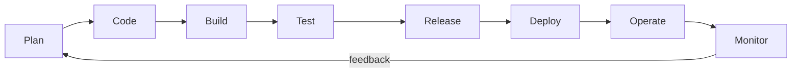

# DevOps

> A culture and set of practices that merge software development and IT operations to ship changes faster, more safely, and more reliably.

---

## What is it?

DevOps is a way of working in which the people who **build** software and the people who **run** it share responsibility for the whole lifecycle — from writing code to operating it in production. It replaces the traditional wall between "developers" (who want to ship features) and "operations" (who want stability) with a single team that owns both goals.

The name is a portmanteau of **Dev**elopment and **Op**erations. It is not a job title, a tool, or a product you can buy — it is a cultural and organizational approach, usually backed by automation.

## Why does it matter?

Before DevOps, a typical release looked like this: developers finished a feature, "threw it over the wall" to an operations team, and moved on. Ops deployed it manually, discovered problems in production, and had no context to fix them. Releases were rare, large, risky, and stressful — so teams released even less often, which made each release riskier still.

DevOps breaks that loop. By automating the path to production and giving one team end-to-end ownership, changes become **small, frequent, and reversible**. Small changes are easier to reason about, faster to review, and cheaper to roll back when something breaks. The result is measurable: high-performing teams deploy more often, recover from incidents faster, and change fail less — the four "DORA" metrics (deployment frequency, lead time for changes, change failure rate, time to restore service).

## How it works

DevOps is commonly summarized by the acronym **CALMS**:

- **Culture** — shared ownership and blameless collaboration between dev and ops.
- **Automation** — remove manual, error-prone steps (builds, tests, deploys, infra).
- **Lean** — small batches, limit work in progress, optimize the whole flow.
- **Measurement** — instrument everything; decide with data, not opinion.
- **Sharing** — spread knowledge and tooling across teams.

Gene Kim's **Three Ways** describe the underlying principles:

```
The First Way  — Flow          : optimize the whole path from dev → production.
The Second Way — Feedback      : create fast feedback loops from prod back to dev.
The Third Way  — Continual     : experiment, learn from failure, and improve.
                 Learning
```

In practice these principles are realized through a toolchain that automates each stage of the loop:



Each stage maps to concrete practices covered elsewhere in this section: [containers](containers.md) package the code, [orchestration](container-orchestration.md) runs it, [CI/CD](ci-cd.md) automates build→deploy, [Infrastructure as Code](infrastructure-as-code.md) provisions the environment, and [observability](observability.md) closes the feedback loop.

## Examples

A change flowing through a DevOps pipeline:

```
1. Developer opens a pull request.
2. CI runs tests, linters, and a security scan automatically.
3. On merge, the pipeline builds a container image and deploys to staging.
4. A canary release sends 5% of production traffic to the new version.
5. Dashboards and alerts watch error rate and latency.
6. If healthy, traffic ramps to 100%; if not, the deploy rolls back automatically.
```

The key property: **no manual gate requires a human to SSH into a server**. The path from commit to production is codified and repeatable.

## When to use

- Teams that want to release frequently and reduce the risk of each release.
- Products with real users where downtime and slow recovery have a cost.
- Organizations trying to break down silos between development and operations.
- Any codebase where "it works on my machine" and manual deploys cause pain.

## When NOT to use

- As a **team name or tool purchase** that leaves the culture unchanged — buying a CI server without shared ownership is cargo-culting, not DevOps.
- For a throwaway script or one-off analysis where the automation overhead outweighs the benefit.
- As an excuse to eliminate operations expertise entirely — DevOps redistributes operational responsibility; it does not make it disappear.

## References

- Gene Kim, Jez Humble, Patrick Debois, John Willis — *The DevOps Handbook*
- [Google — DORA / DevOps Research and Assessment](https://dora.dev/)
- [Atlassian — What is DevOps?](https://www.atlassian.com/devops)
