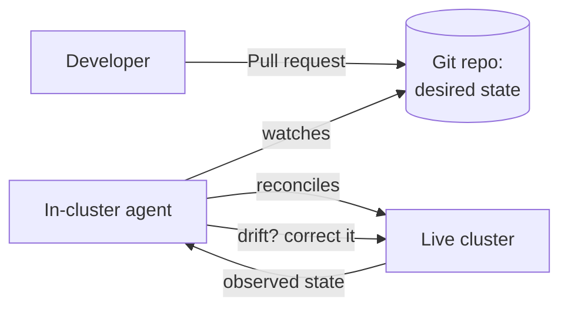

# GitOps

> An operating model where a Git repository is the single source of truth for a system's desired state, and an automated agent continuously reconciles the live system to match it.

---

## What is it?

GitOps is a way to operate infrastructure and applications where **everything that describes the running system lives in Git** — deployment manifests, configuration, infrastructure definitions — and changes to the system happen only by changing Git. An automated agent running in the target environment watches the repository and continuously makes the live system match what the repo says it should be.

You don't run `deploy` commands against production. You merge a pull request, and the system converges to the new desired state on its own.

## Why does it matter?

If Git is the source of truth and nothing changes the system except Git, then Git's strengths become operational superpowers: every change is **reviewed** (pull request), **audited** (commit history says who changed what and when), and **reversible** (revert the commit and the system rolls back). The entire desired state is versioned, so you can recreate an environment by pointing an agent at the repo.

It also closes a gap that plain [CI/CD](ci-cd.md) leaves open. A push-based pipeline deploys and then walks away; if someone later changes the cluster by hand, nothing corrects it. GitOps' continuous reconciliation actively **detects and reverts drift**, keeping the live system honest to the repo.

## How it works

GitOps rests on two ideas: **declarative desired state in Git**, and **pull-based reconciliation**.



- **Pull, not push** — instead of a CI pipeline pushing changes *into* the cluster, an agent *inside* the cluster pulls the desired state *out* of Git. Credentials stay in the cluster; the pipeline never needs production access.
- **Continuous reconciliation** — the agent loops forever, comparing Git to reality and correcting any difference — whether the difference came from a new commit or from someone editing the cluster manually.

Tools like Argo CD and Flux implement this model, most commonly for [Kubernetes](../orchestration/kubernetes.md), though the pattern applies to any declarative system (including [Infrastructure as Code](infrastructure-as-code.md)).

## Examples

The GitOps workflow for shipping a change — note there is no deploy command:

```
1. Edit the image tag in the manifest:  image: my-api:1.0 → my-api:1.1
2. Open a pull request; a teammate reviews and merges it.
3. The in-cluster agent notices the repo changed.
4. It applies the new manifest; the cluster rolls out my-api:1.1.
5. Rollback = `git revert` the commit; the agent rolls the cluster back.
```

Detecting drift — someone hand-edits the cluster:

```
Someone runs:   kubectl scale deployment/web --replicas=1
Git still says: replicas: 3
→ The agent sees the mismatch and scales back to 3. Git wins.
```

## When to use

- Kubernetes fleets and other declarative systems where desired state can be fully expressed as files.
- Teams that want deployments to be reviewed, audited, and trivially reversible.
- Environments where you want to keep CI/CD credentials out of production (pull-based security).
- Managing many clusters/environments consistently from a repository.

## When NOT to use

- Systems whose state **cannot** be fully declared as versioned files (heavy imperative or manual operational steps).
- Very small setups where a simple push deploy is enough and running a reconciliation agent is overhead.
- Workflows that fundamentally require imperative, ad-hoc control that doesn't map to "edit a file, converge."

## References

- [OpenGitOps — Principles](https://opengitops.dev/)
- [Weaveworks — Guide to GitOps](https://www.weave.works/technologies/gitops/)
- [Argo CD documentation](https://argo-cd.readthedocs.io/)
