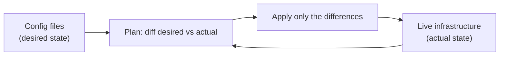

# Infrastructure as Code

> Managing servers, networks, and cloud resources by writing declarative configuration files that are versioned and applied automatically, instead of clicking through consoles or running manual commands.

---

## What is it?

Infrastructure as Code (IaC) means describing your infrastructure — virtual machines, networks, load balancers, databases, DNS records, permissions — in **text files**, and using a tool to create and change that infrastructure from those files. The files are the source of truth: to add a server you edit code and apply it, not click a web console.

Because the infrastructure is now code, it lives in version control, gets reviewed in pull requests, and can be recreated from scratch at any time.

## Why does it matter?

Infrastructure created by hand is a **snowflake**: unique, undocumented, and impossible to reproduce exactly. When the server dies or you need an identical staging environment, nobody remembers the exact sequence of clicks. Configurations drift as people make ad-hoc changes, and "works in staging, breaks in production" becomes routine because the two were never actually the same.

IaC eliminates snowflakes. The same code produces the same environment every time, so staging genuinely matches production. Changes are reviewed before they happen, audited through git history, and reversible by reverting a commit. Spinning up an entire environment for a test — then tearing it down — becomes a single command. This is what makes environments **reproducible** and disaster recovery **practical** rather than aspirational.

## How it works

Most IaC tools are **declarative**: you describe the desired end state, and the tool figures out the actions needed to reach it. This is different from an **imperative** script that lists the steps.

```
Imperative  : "create a VM, then attach a disk, then open port 443"  (you specify HOW)
Declarative : "there should be a VM with a disk and port 443 open"   (you specify WHAT)
```

Two properties make this reliable:

- **Idempotency** — applying the same configuration twice produces the same result. Running it again when nothing changed does nothing; the tool only acts on the difference.
- **State / drift detection** — the tool keeps a record of what it manages and compares it to the real world. If someone changed a resource by hand ("drift"), the next apply detects and corrects it.



There are two common flavours: **provisioning** tools like [Terraform](../iac/terraform.md) create and destroy cloud resources, while **configuration management** tools like [Ansible](../iac/ansible.md) configure software *inside* existing machines. Many stacks use both.

## Examples

Declaring a cloud resource — the tool decides how to create, update, or leave it alone:

```hcl
resource "aws_instance" "web" {
  ami           = "ami-0abcd1234"
  instance_type = "t3.micro"
  tags = {
    Name = "web-server"
  }
}
```

The workflow is *plan then apply* — you always preview the change before it happens:

```bash
terraform plan    # shows: + create aws_instance.web
terraform apply   # makes reality match the code
```

Run `apply` again with no code change and it reports "no changes" — that is idempotency in action.

## When to use

- Any cloud or multi-server environment that must be reproducible and auditable.
- Teams that want infrastructure changes reviewed like application code.
- Creating identical dev/staging/production environments.
- Disaster recovery, where you must rebuild infrastructure quickly and exactly.

## When NOT to use

- A single hand-managed machine for a hobby project, where the tooling overhead isn't justified.
- Genuinely one-time, exploratory changes you will never repeat (though even these are often worth codifying).
- As a reason to **mix** manual console changes with IaC on the same resources — that reintroduces drift and defeats the purpose; pick one source of truth.

## References

- Kief Morris — *Infrastructure as Code*
- [HashiCorp — What is Infrastructure as Code?](https://developer.hashicorp.com/terraform/intro)
- [Red Hat — What is IaC?](https://www.redhat.com/en/topics/automation/what-is-infrastructure-as-code-iac)
