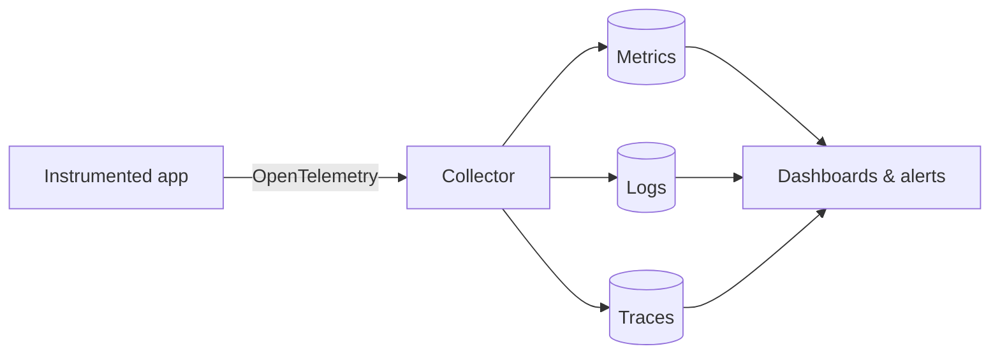

# Observability

> The ability to understand what a system is doing internally by examining the data it emits — logs, metrics, and traces — so you can answer questions you didn't anticipate.

---

## What is it?

Observability is a property of a system: how well you can infer its internal state from the outside, using the telemetry it produces. A system is "observable" when, faced with a new problem, you can explore its data and figure out the cause **without shipping new code to add the missing instrumentation**.

It is built on three primary signal types, often called the **three pillars**: **logs** (discrete events), **metrics** (numeric measurements over time), and **traces** (the path of a single request across services).

## Why does it matter?

Traditional **monitoring** answers questions you knew to ask in advance: "is CPU above 90%?", "is the site up?". It works for **known** failure modes. Modern systems — many microservices, dynamic scaling, third-party dependencies — fail in **unknown** ways that no pre-built dashboard anticipated.

Observability is about the **unknown-unknowns**. When latency spikes for 2% of users on one endpoint in one region, no fixed alert covers that; you need to slice and correlate the raw telemetry to find it. The payoff is faster incident diagnosis: instead of guessing and redeploying, you ask the data. This is what makes it possible to operate complex systems and to define the reliability targets that [SRE](site-reliability-engineering.md) depends on.

## How it works

The three pillars answer different questions and complement each other:

```
Metrics  →  "Is something wrong, and how much?"   (aggregated numbers, cheap, alertable)
Logs     →  "What exactly happened at that moment?" (detailed events, high volume)
Traces   →  "Where in the request path is the time going?" (per-request, cross-service)
```

- **Metrics** are numeric time series — request rate, error count, latency percentiles, memory usage. They are compact and ideal for dashboards and alerts. [Prometheus](../observability/prometheus.md) is a common metrics store; [Grafana](../observability/grafana.md) visualizes them.
- **Logs** are timestamped records of individual events. Aggregated and searchable (e.g. the [ELK stack](../observability/elk-stack.md)), they give the detail behind a metric spike.
- **Traces** follow one request as it hops between services, showing where latency and errors originate. [Jaeger](../observability/jaeger.md) is a tracing backend.

The emerging standard for producing all three is **[OpenTelemetry](../observability/opentelemetry.md)** — a vendor-neutral set of APIs and agents, so instrumentation isn't tied to one backend.



## Examples

The same incident, seen through each pillar:

```
1. METRIC alert fires:  error_rate for /checkout jumped from 0.1% to 7%.
2. TRACE of a failing request shows the time is spent in the "payments" service,
   which returns 500 on a downstream call.
3. LOGS from payments at that timestamp reveal: "connection pool exhausted".
   → Root cause found without adding any new instrumentation.
```

A metric definition (Prometheus-style) that powers the alert above:

```
# HELP http_requests_total Total HTTP requests
# TYPE http_requests_total counter
http_requests_total{path="/checkout", status="500"}  1423
```

## When to use

- Distributed systems and microservices, where failures cross service boundaries.
- Production services with reliability targets (SLOs) and on-call rotations.
- Any system complex enough that you cannot predict every failure mode up front.
- Debugging performance problems that only appear under real production load.

## When NOT to use

- As a reason to collect **everything** blindly — unbounded high-cardinality metrics and verbose logs are expensive and can cost more than the system they watch. Instrument deliberately.
- A tiny static site or script, where a single uptime check is enough.
- As a replacement for good alerting on known conditions — observability complements monitoring, it doesn't remove the need for basic health checks.

## References

- Charity Majors, Liz Fong-Jones, George Miranda — *Observability Engineering*
- [OpenTelemetry documentation](https://opentelemetry.io/docs/)
- [Google SRE Book — Monitoring Distributed Systems](https://sre.google/sre-book/monitoring-distributed-systems/)
