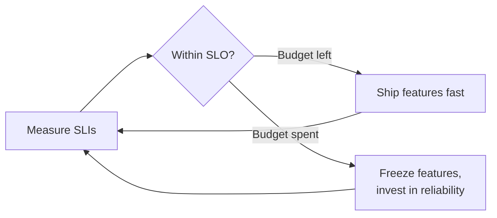

# Site Reliability Engineering

> A discipline that applies software-engineering practices to operations, using explicit reliability targets and error budgets to balance new features against system stability.

---

## What is it?

Site Reliability Engineering (SRE) is an approach to running production systems, originated at Google, that treats operations as a **software problem**. Rather than a separate ops team manually keeping services alive, SREs write software to automate operations and hold services to **measurable reliability targets**.

Its defining idea is the **error budget**: reliability is a number you agree on (say, 99.9% availability), which means you also accept a specific amount of allowed unreliability — and you spend that budget deliberately.

## Why does it matter?

Development and operations have a built-in tension: developers are rewarded for shipping features (change), operations for keeping things stable (no change). Left unmanaged, this turns into an argument with no objective referee.

SRE resolves it with data. If you define reliability as an explicit target, then "how much risk can we take shipping features?" has a **quantified answer**: whatever the error budget allows. While the service is comfortably within budget, teams ship freely. When the budget is exhausted, the priority automatically shifts to reliability work until it recovers. The negotiation becomes a shared metric instead of a turf war — which is why SRE is often described as "a concrete implementation of [DevOps](devops.md)."

## How it works

SRE is built on a hierarchy of related terms:

```
SLI  (Indicator)  — a measured number: e.g. % of requests served < 300ms.
SLO  (Objective)  — the internal target for an SLI: e.g. 99.9% over 30 days.
SLA  (Agreement)  — an external promise to customers, with consequences if missed.
                    (SLA is usually looser than the SLO you run to internally.)

Error budget = 100% − SLO.
   99.9% availability ⇒ 0.1% budget ⇒ ~43 minutes of allowed downtime per month.
```

- **SLIs** come straight from [observability](observability.md) data — latency, error rate, availability.
- **SLOs** turn an SLI into a goal. Crucially, the goal is **not 100%** — perfect reliability is infinitely expensive and unnecessary.
- The **error budget** is the room between the SLO and 100%. It is a currency: spend it on risky deploys, experiments, and velocity.
- **Toil** — repetitive manual operational work — is explicitly tracked and engineered away, so SREs spend time building automation, not firefighting.



## Examples

An availability SLO and its error budget in practice:

```
Target SLO: 99.9% of checkout requests succeed over 30 days.

Total requests this month : 10,000,000
Allowed failures (budget) : 0.1% = 10,000 failed requests
Failures so far           : 3,200

→ 68% of the error budget remains → keep shipping.
→ If it hit 100%, halt risky launches and fix reliability first.
```

An SLI defined over metrics ([Prometheus](../observability/prometheus.md)-style):

```
availability = sum(rate(http_requests_total{status!~"5.."}[30d]))
             / sum(rate(http_requests_total[30d]))
```

## When to use

- Production services with real reliability requirements and on-call rotations.
- Organizations that want an objective way to balance feature velocity against stability.
- Teams drowning in manual operational toil that could be automated.
- Systems large enough that "just try harder to keep it up" no longer scales.

## When NOT to use

- Chasing **100% reliability** or setting SLOs far stricter than users actually need — the cost grows disproportionately and the error budget loses its purpose.
- Tiny projects or internal tools where formal SLOs and error budgets are pure ceremony.
- As a **rebranded ops team** with no automation mandate and no error budgets — that is SRE in name only.

## References

- Betsy Beyer et al. — *Site Reliability Engineering* (the Google SRE Book)
- [Google — SRE Book (free online)](https://sre.google/sre-book/table-of-contents/)
- [Google — The Site Reliability Workbook](https://sre.google/workbook/table-of-contents/)
