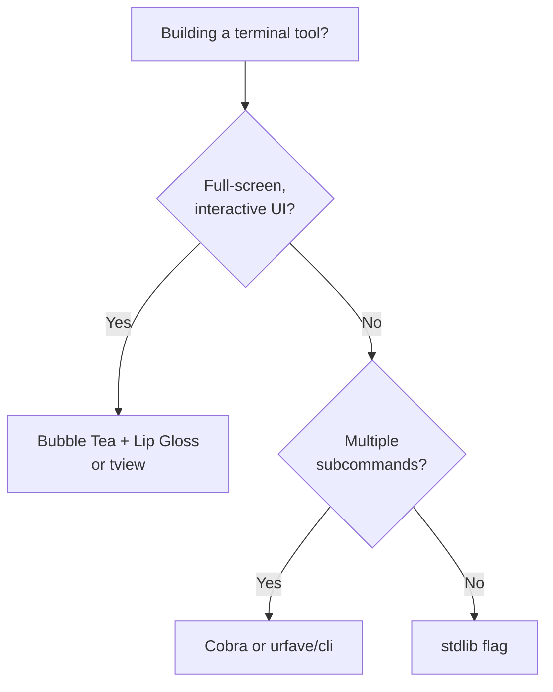

# Go for CLIs & Terminal Apps

> Why Go became a default choice for command-line tools — single static binaries, trivial cross-compilation, fast startup — and a map of the ecosystem from the stdlib `flag` package to Cobra and Bubble Tea.

---

## What is it?

A **command-line interface (CLI)** is a program you drive by typing a command, flags, and arguments into a terminal instead of clicking a GUI. Go is one of the most popular languages for writing them: `docker`, `kubectl`, `terraform`, `gh` (GitHub CLI), and `hugo` are all Go programs.

This article is the entry point to the CLI & Terminal cluster. It explains *why* Go fits this niche so well and *which* library to reach for, then hands off to the deep dives: [Building CLIs](building-clis.md), [CLI Best Practices](best-practices.md), [Terminal UIs](tui.md), and [Terminal & Shell](terminal-and-shell.md).

## Why does it matter?

Distributing a CLI is often harder than writing it. Interpreted languages force your users to have the right runtime and dependency versions installed; that friction kills adoption for a tool meant to be run everywhere — laptops, CI runners, containers, servers.

Go removes that friction. `go build` produces a **single, statically-linked binary** with no runtime to install and no `node_modules`/`venv` to ship. A user downloads one file, marks it executable, and runs it. For a tool distributed to thousands of machines, that is the whole ballgame.

## How it works

A Go CLI is just a `main` package. The runtime, the garbage collector, and every dependency are compiled into the output file. The properties that matter for CLIs fall out of the toolchain:

```
Go source  ──go build──▶  single static binary  ──ship──▶  runs anywhere (same GOOS/GOARCH)
                │
                └── cross-compile: GOOS=linux  GOARCH=arm64  go build
                    GOOS=windows GOARCH=amd64 go build   (no C toolchain needed for pure-Go code)
```

### Why Go is a strong fit for CLIs

| Property | What it buys you |
|---|---|
| **Single static binary** | No runtime, no interpreter, no dependency install on the user's machine. One file to distribute. |
| **Trivial cross-compilation** | Set `GOOS`/`GOARCH` and build for Linux/macOS/Windows on any host, from one machine — no VM or CI matrix required (for pure-Go code). See [Deploy](../deploy.md). |
| **Fast startup** | A compiled binary starts in single-digit milliseconds — critical for a tool invoked constantly in shells, scripts, and pipes, and for shell completion. |
| **Low, predictable memory** | No warm-up, no JIT; small resident footprint suits short-lived processes. |
| **Concurrency built in** | Goroutines + `context` make parallel downloads, fan-out API calls, and cancellable long jobs natural. See [Concurrency](../concurrency.md) and [Context](../context.md). |
| **Batteries-included stdlib** | `flag`, `os`, `os/exec`, `bufio`, `encoding/json`, `text/tabwriter` cover most CLI needs with zero dependencies. |
| **One-command tooling** | `go install pkg@latest` lets other Go users install your tool directly from source. |

### The ecosystem: what to reach for

There are three layers. Pick the lowest one that meets your needs.

```
┌─────────────────────────────────────────────────────────────┐
│  TUI (full-screen interactive)   Bubble Tea + Lip Gloss,     │
│                                  Bubbles · tview              │
├─────────────────────────────────────────────────────────────┤
│  Command framework (subcommands) Cobra · urfave/cli          │
├─────────────────────────────────────────────────────────────┤
│  Standard library                flag · os.Args · os/exec    │
└─────────────────────────────────────────────────────────────┘
```

**Standard library (`flag`)** — parses flags and arguments with zero dependencies. Perfect for a single-purpose tool (`mytool --verbose input.txt`). No subcommands, no completion, minimal help.

**Cobra** — the de-facto framework for multi-command CLIs (`git`-style: `tool commit`, `tool push`). Powers `kubectl`, `hub`, `gh`, and Hugo. Gives you subcommands, nested commands, flag inheritance, auto-generated help, and shell completion. Pairs with **Viper** for layered configuration (flags → env → file). Covered in [Building CLIs](building-clis.md).

**urfave/cli** — a lighter alternative to Cobra with a more declarative, struct/closure-based API. Great when you want subcommands without Cobra's code-generation style.

**Charm stack (Bubble Tea, Lip Gloss, Bubbles)** — for **TUIs**: full-screen, interactive terminal apps (think `htop`, an interactive picker, a dashboard). Bubble Tea uses the Elm architecture; Lip Gloss handles styling; Bubbles provides ready-made widgets. Covered in [Terminal UIs](tui.md). **tview** is an alternative, widget-oriented TUI toolkit.

### Choosing between them



## Examples

The smallest useful CLI needs nothing beyond the standard library:

```go
package main

import (
	"flag"
	"fmt"
	"os"
)

func main() {
	// Define flags: name, default, usage.
	upper := flag.Bool("upper", false, "print the greeting in uppercase")
	name := flag.String("name", "world", "who to greet")
	flag.Parse()

	greeting := fmt.Sprintf("Hello, %s!", *name)
	if *upper {
		greeting = fmt.Sprintf("HELLO, %s!", *name)
	}

	// Diagnostics go to stderr; results go to stdout (see best-practices).
	if flag.NArg() > 0 {
		fmt.Fprintln(os.Stderr, "warning: extra arguments ignored")
	}
	fmt.Println(greeting)
}
```

```console
$ go build -o greet . && ./greet --name Ada --upper
HELLO, Ada!
```

That single binary runs on any machine with the same OS/architecture — no Go installation required. Cross-compile it for another platform in one line:

```console
$ GOOS=windows GOARCH=amd64 go build -o greet.exe .
```

For anything larger — subcommands, config files, completion — move up to Cobra ([Building CLIs](building-clis.md)).

## When to use

- Distributing a tool to machines you don't control (users' laptops, CI, containers) where you can't assume a runtime is installed.
- Tools invoked frequently or in tight loops, where fast startup matters.
- Cross-platform tools you want to build for Linux, macOS, and Windows from one machine.
- DevOps/infrastructure tooling, Git-style multi-command tools, and API clients.
- Tools that benefit from concurrency (parallel network calls, batch processing).

## When NOT to use

- **A one-off script** that only ever runs on your machine — a shell or Python script is faster to write and needs no build step.
- **Heavy scientific/ML workloads** where you need NumPy/PyTorch and their ecosystems; Go's numeric ecosystem is thinner.
- **When your team has zero Go experience** and the tool is trivial — the distribution win may not offset the ramp-up.
- **GUI applications** — Go's desktop-GUI story is weaker than its CLI/TUI story; for terminal-native interactivity, prefer a [TUI](tui.md) instead.

## References

- [Command Line Interface Guidelines (clig.dev)](https://clig.dev/) — the canonical guide to CLI design, language-agnostic.
- [Cobra documentation](https://cobra.dev/)
- [Charm — Bubble Tea](https://github.com/charmbracelet/bubbletea)
- [Go: `flag` package](https://pkg.go.dev/flag)
- [How to Write Go Code](https://go.dev/doc/code)
