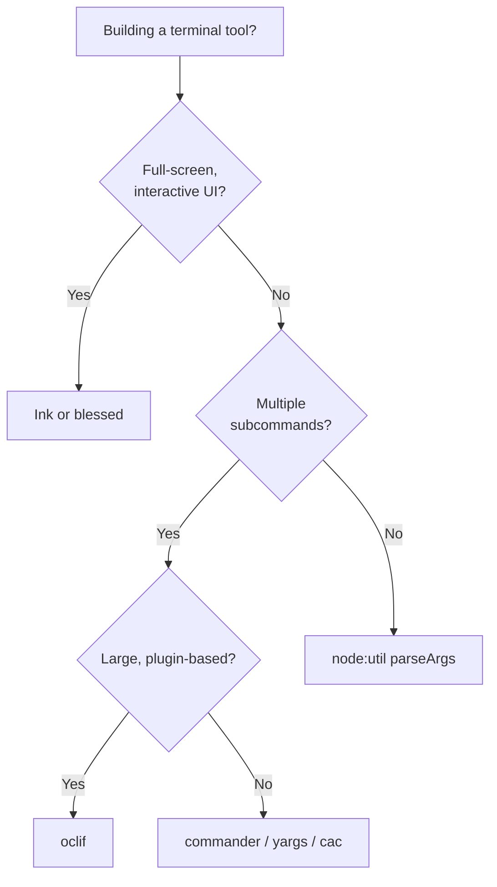

# Node.js for CLIs & Terminal Apps

> Why a huge share of developer tooling ships as Node.js CLIs — the ecosystem and reach that win despite needing a runtime — and a map from the built-in `parseArgs` to Commander, oclif, and Ink.

---

## What is it?

A **command-line interface (CLI)** is a program you drive by typing a command, flags, and arguments into a terminal. Node.js is one of the most common runtimes for writing them: `npm`, `eslint`, `prettier`, `vite`, `webpack`, the Vercel/Netlify/AWS-CDK CLIs, and `create-*` scaffolders are all Node programs.

This article is the entry point to the CLI & Terminal cluster. It explains *why* Node fits developer tooling so well and *which* library to reach for, then hands off to the deep dives: [Building CLIs](building-clis.md) and [Terminal UIs](tui.md).

## Why does it matter?

If your project, team, or ecosystem already lives in JavaScript/TypeScript, Node is the path of least resistance for tooling. Your CLI shares the same language, package manager, and libraries as the code it operates on — a lint runner, a codegen tool, or a project scaffolder written in Node can `import` the very packages it configures.

The reach is the other half. Any machine with Node installed can run your tool, and `npx your-tool` executes it **without a global install** — the single most frictionless distribution story for developer audiences, who already have Node. For a tool aimed at JS developers, "they already have the runtime" flips Node's usual weakness into a strength.

## How it works

A Node CLI is a script with an executable shebang and a `bin` entry in `package.json`. When installed (globally or via `npx`), the package manager puts a launcher on `PATH` that points at your script.

```jsonc
// package.json
{
  "name": "todo",
  "version": "1.0.0",
  "type": "module",
  "bin": { "todo": "./dist/cli.js" }, // command name -> entry file
  "engines": { "node": ">=18" }
}
```

```ts
#!/usr/bin/env node
// dist/cli.js — the shebang lets the OS run it directly
console.log("hello");
```

`npm install -g .` (or publishing then `npm i -g todo`) creates a `todo` command; `npx todo` runs it on demand. The properties that shape the ecosystem:

| Property | What it means for CLIs |
|---|---|
| **Runtime required** | The user needs Node installed (or a bundled binary). Slower to distribute to non-JS audiences than a Go/Rust static binary. |
| **`npx` on-demand run** | JS developers run your tool with zero install — huge for one-shot scaffolders and generators. |
| **Massive ecosystem** | npm has a package for everything a CLI needs: parsing, prompts, spinners, HTTP, file globbing. |
| **Slower cold start** | Node boots in tens of milliseconds plus module load — fine for most tools, noticeable in tight shell loops. |
| **Async-first** | The event loop and `async`/`await` make parallel network/file work natural. See [Asynchronous Patterns](../async-patterns.md). |
| **Bundle to one file** | esbuild/rollup, or `node --experimental-sea` and tools like `pkg`, can produce a single artifact when you must avoid `node_modules`. |

### The ecosystem: what to reach for

Three layers — pick the lowest one that meets your needs.

```
┌─────────────────────────────────────────────────────────────┐
│  TUI (full-screen interactive)   Ink (React) · blessed       │
├─────────────────────────────────────────────────────────────┤
│  Command framework (subcommands) commander · yargs · oclif   │
│                                  · cac                        │
├─────────────────────────────────────────────────────────────┤
│  Standard library                node:util parseArgs         │
│                                  · process.argv               │
└─────────────────────────────────────────────────────────────┘
```

**Built-in (`node:util` `parseArgs`)** — since Node 18, the standard library parses flags and positionals with zero dependencies. Perfect for a single-purpose tool. No subcommands, no generated help.

**Commander** — the most widely used framework for multi-command CLIs (`git`-style: `tool add`, `tool list`). Subcommands, options with types and defaults, auto-generated help, and validation. Covered in [Building CLIs](building-clis.md).

**yargs** — a mature alternative with a fluent builder API and rich middleware/completion features. **cac** is a tiny, fast option. **oclif** (from Salesforce/Heroku) is a heavier, opinionated *framework* — plugins, auto-generated docs, a command-per-file layout — for large CLIs like the Heroku and Salesforce tools.

**Ink** — for **TUIs**: full-screen, interactive terminal apps built with **React** components and hooks. Covered in [Terminal UIs](tui.md). **blessed** is the older imperative alternative.

### Choosing between them



## Examples

The smallest useful CLI needs nothing beyond the standard library:

```ts
#!/usr/bin/env node
import { parseArgs } from "node:util";

const { values, positionals } = parseArgs({
  options: {
    upper: { type: "boolean", default: false },
    name: { type: "string", default: "world" },
  },
  allowPositionals: true,
});

let greeting = `Hello, ${values.name}!`;
if (values.upper) greeting = greeting.toUpperCase();

// Diagnostics go to stderr; results go to stdout (see building-clis).
if (positionals.length > 0) {
  process.stderr.write("warning: extra arguments ignored\n");
}
process.stdout.write(greeting + "\n");
```

```console
$ node greet.js --name Ada --upper
HELLO, ADA!
```

For anything larger — subcommands, config files, completion — move up to Commander ([Building CLIs](building-clis.md)).

## When to use

- Tooling aimed at JavaScript/TypeScript developers, who already have Node and can `npx` your tool instantly.
- CLIs that share code with a JS/TS codebase (linters, codegen, build tools, project scaffolders).
- I/O-bound tools doing lots of network or file work in parallel, where async shines.
- When you want the npm ecosystem's breadth of ready-made CLI building blocks.

## When NOT to use

- **Distributing to audiences without Node** (ops teams, general consumers) where a single static binary matters — prefer Go or Rust. See [Go for CLIs](../../go/cli/overview.md).
- **Ultra-fast, frequently-invoked tools** in tight shell loops, where Node's startup overhead adds up.
- **A trivial one-off on your own machine** — a shell script is faster to write and needs no `package.json`.
- **Heavy CPU-bound number crunching** — the single-threaded event loop and JS numerics are a poor fit without worker threads.

## References

- [Command Line Interface Guidelines (clig.dev)](https://clig.dev/) — the canonical, language-agnostic guide to CLI design.
- [Node.js `util.parseArgs`](https://nodejs.org/api/util.html#utilparseargsconfig)
- [Commander.js](https://github.com/tj/commander.js)
- [oclif — The Open CLI Framework](https://oclif.io/)
- [Ink — React for CLIs](https://github.com/vadimdemedes/ink)
