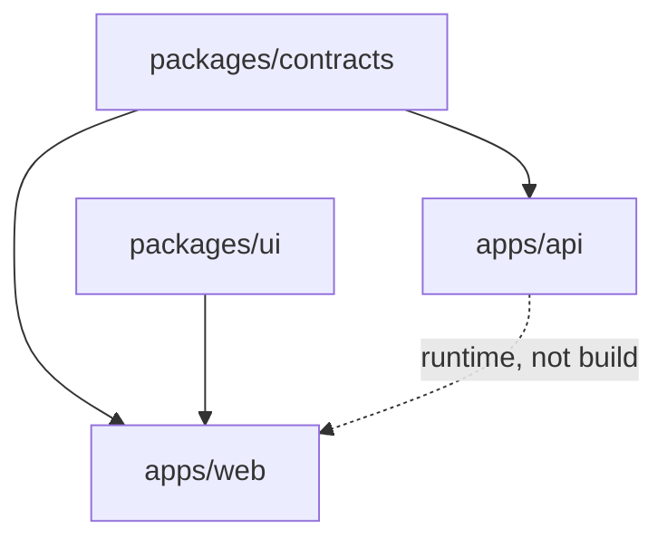

# Inside a Monorepo

> The machinery of a single repository holding many projects — the workspace layer, the internal dependency graph, the one-version rule, ownership without repository walls, and the four costs that arrive whether you planned for them or not.

---

## What is it?

This article is about the inside of the box. [Monorepo vs Polyrepo](monorepo-vs-polyrepo.md) argues about which box to pick; this one assumes you picked the single repository and asks what actually has to be true for it to work.

A monorepo is not just several projects that happen to share a `.git` directory. That arrangement exists — people call it a "junk drawer repo" — and it fails in a specific way: nothing resolves dependencies between the projects, so they either duplicate code or reach into each other's source trees by relative path. What turns a shared directory into a monorepo is a **workspace layer**: something that knows the projects exist, knows which depends on which, and resolves those dependencies from disk instead of a registry.

Everything else in this article follows from that one addition.

---

## Why does it matter?

The workspace layer is what converts the monorepo's theoretical benefit into a real one. Without it, "one repository" buys you a shared commit history and nothing else — no atomic cross-project change that actually compiles, no single lockfile, no way to ask what depends on what.

With it, four things become possible that were not: internal dependencies with no publish step, one resolved version of every third-party library, a machine-readable dependency graph you can build CI on, and a refactor whose completeness the compiler can verify.

And four costs arrive at the same time. They are not hypothetical, they are not avoidable by being careful, and the rest of this article spends as much space on them as on the benefits — because the benefits are what people already believe and the costs are what surprises them.

---

## How it works

### The workspace layer

The root of the repository declares which directories are projects. The exact syntax belongs to your ecosystem ([Package-Manager Workspaces](tooling/package-manager-workspaces.md) covers all of them), but the shape is always the same:

```
  my-system/
    apps/
      api/          ── its own manifest, its own build
      web/          ── its own manifest, its own build
    packages/
      contracts/    ── depended on by both apps
      ui/           ── depended on by web only
    <root manifest>   declares: apps/*, packages/*
    <one lockfile>
```

Three consequences, and the third is the one people underrate:

1. **Members are discovered by glob.** Adding a project means creating a directory, not editing a registry.
2. **Internal dependencies resolve to disk.** `apps/web` declaring a dependency on `packages/ui` gets a symlink or a path reference, not a download. Edit `ui`, and `web` sees it immediately — no build, no publish, no version.
3. **One lockfile.** Every project resolves third-party dependencies from the same tree, which is where the one-version rule comes from.

### The internal dependency graph

Once the workspace layer exists, the repository has a graph, and the graph is the thing every monorepo tool operates on:



Two rules keep this graph useful. It must be **acyclic** — most workspace tools will refuse a cycle, and the ones that allow it produce build orders that are stable until they suddenly are not. And it should be **shallow**: a chain of six internal packages means a change at the bottom rebuilds all six, which is how a monorepo gets slow without getting big.

Note the dotted edge. `api` and `web` talk over HTTP at runtime; that is not a build dependency and must not be modelled as one. Confusing the two is the most common way a dependency graph becomes wrong.

### The one-version rule

One lockfile means one resolved version of each third-party library across every project. This is a real and underappreciated benefit: the class of bug where two packages in the same process see different copies of the same library simply does not occur.

It is also a real constraint. Upgrading a library upgrades it *everywhere*, in one commit, and if one of your six projects is not ready, nobody upgrades. The escape hatches — per-project overrides, aliased installs — work, and each one is a small deliberate hole in the guarantee. Google enforces the rule strictly; most small repositories should treat it as a default they occasionally break on purpose.

### Ownership and review without repository walls

The polyrepo got review routing for free: the repository was the unit, and access to it was the permission. Collapse that and you need something to replace it.

`CODEOWNERS` is the standard answer — a file mapping path globs to reviewers, enforced by the host:

```
/packages/contracts/   @platform-team
/apps/mobile/          @mobile-team
/apps/api/             @backend-team @platform-team
```

Use team handles, never individuals — a personal handle is a single point of failure the day that person is on holiday. Two failure modes to watch for: a file that grows a rule per directory until nobody knows who actually reviews anything, and a root-level catch-all that routes every pull request to one overloaded team.

At one or two people this whole mechanism is dead weight. Skip it, and know why you are skipping it.

### Versioning and release

A repository tag means nothing when the repository holds five things that ship on different schedules. Two coherent models:

- **Fixed (lockstep).** Everything carries the same version and releases together. Simple, honest, and wasteful — a patch to one package bumps all of them. Fine for a set of packages that are genuinely one product.
- **Independent.** Each package versions itself; tags are namespaced `contracts@1.5.0` rather than `v1.5.0`. This is what most repositories need, and it requires tooling to work.

The tooling is Changesets (a per-change intent file, versions computed at release), Lerna (the original, now maintained by the Nx team), semantic-release, or release-please. All of them derive the bump from commit history, which is the practical argument for [Conventional Commits](../../../tools/git/conventional-commits.md) here: the commit scope tells the tool which package changed.

If you publish nothing — the common case for a private product — skip all of it. Deploy from a commit SHA and do not invent versions you have no consumers for.

### Checkout size and Git's limits

A monorepo's working tree is the sum of everything, and Git's own [design](../../../tools/git/overview.md) assumes a working tree you can stat in reasonable time. Long before you hit that wall, you hit annoyances: slow clones in CI, slow editor indexing, a `git status` that pauses.

The graduated responses, cheapest first: shallow clones in CI (`--depth=1` for a build that only needs the current tree); [partial clone](https://git-scm.com/docs/partial-clone) (`--filter=blob:none`, fetches blobs on demand); sparse-checkout (materialise only the directories you work in); then, at genuinely extreme scale, Microsoft's Scalar or Meta's Sapling.

Keep large binaries out from the start — Git LFS or an artefact store. A 200 MB design asset committed once is in every clone forever, and removing it later means rewriting history.

### The four costs

Stated plainly, because they arrive regardless:

1. **CI gets slower by default.** Naively, every push builds everything. Fixing this is a whole article ([Monorepo CI](monorepo-ci.md)) and the fix is never free.
2. **You own tooling you did not own before.** The workspace layer, and whatever you stack on it, is now yours to maintain and upgrade.
3. **Boundaries need a new enforcement mechanism.** Nothing stops `apps/web` from importing `apps/api/src/internal/db.ts`. The publish step used to make that impossible; now it is an import away. A lint rule (`eslint` import restrictions, dependency-cruiser, Nx tags, Bazel `visibility`) is the replacement, and it costs an afternoon on day one versus a month later.
4. **Coarse access control.** Anyone who can clone can read everything. Per-path restrictions exist on some hosts and are awkward everywhere.

Cost 3 is the one that quietly decides whether the repository is still pleasant in two years. Within a single project, the same question — what may import what — is answered by [project organization](../cli/project-organization.md); the monorepo just raises it one altitude, between projects instead of inside one.

---

## Examples

A workspace declaration and an internal dependency, in the shape every ecosystem repeats:

```yaml
# pnpm-workspace.yaml — members discovered by glob
packages:
  - "apps/*"
  - "packages/*"
```

```json
// apps/web/package.json — resolved from disk, not from a registry
{
  "name": "@my-system/web",
  "dependencies": {
    "@my-system/contracts": "workspace:*",
    "@my-system/ui": "workspace:*"
  }
}
```

`workspace:*` is the important token: it says "whatever is in this repository", and it fails loudly rather than silently falling back to a published package of the same name.

The boundary rule that replaces the publish step, expressed as lint configuration rather than hope:

```javascript
// eslint.config.js — apps may import packages; packages may not import apps,
// and nothing may reach into another project's internals.
{
  rules: {
    "no-restricted-imports": ["error", {
      patterns: [
        { group: ["@my-system/*/src/**"], message: "Import the package entry point, not its internals." },
        { group: ["../../apps/**"],       message: "Shared packages must not depend on applications." },
      ],
    }],
  },
}
```

---

## When to use

- Several projects that share code and change together, where the shared code has no life as a published artefact.
- Any repository where you want a refactor's completeness checked by the compiler rather than by memory.
- Teams adopting independent versioning who are willing to run the release tooling it requires.
- **Solo and very small teams**, where the workspace layer is usually the entire tooling investment needed and the ownership machinery above can be skipped outright — see [Solo and Small-Team Repository Layout](solo-and-small-team-repositories.md).

## When NOT to use

- **A shared `.git` with no workspace layer** — projects then reach into each other by relative path, which is coupling with none of the benefits; declare the workspace or accept that you have several repositories in a trench coat.
- **Modelling runtime dependencies as build dependencies** — putting an edge from `api` to `web` because they talk over HTTP corrupts the build order and every affected-target query that reads the graph.
- **A deep chain of internal packages** — six layers of `packages/*` means a leaf change rebuilds all six; shallow graphs stay fast, and a package that exists only to re-export another should not exist.
- **Adopting independent versioning with no consumers** — if nothing outside the repository installs your packages, versions and tags are ceremony; deploy from the commit SHA.
- **A `CODEOWNERS` file at two people** — review routing solves a problem you do not have, and an unmaintained owners file is worse than none because it blocks pull requests on reviewers who have moved on.
- **Committing large binaries because the repository is "the one place everything lives"** — every clone carries them forever; use LFS or an artefact store from the first commit.

---

## References

- Potvin, Rachel, and Josh Levenberg. [Why Google Stores Billions of Lines of Code in a Single Repository](https://cacm.acm.org/magazines/2016/7/204032-why-google-stores-billions-of-lines-of-code-in-a-single-repository/fulltext). *Communications of the ACM*, 59(7), 2016 — the origin of the one-version rule as a stated policy.
- [pnpm — Workspace](https://pnpm.io/workspaces) and [the `workspace:` protocol](https://pnpm.io/workspaces#workspace-protocol-workspace) — the clearest specification of workspace resolution semantics.
- [Git — partial clone](https://git-scm.com/docs/partial-clone) and [`git sparse-checkout`](https://git-scm.com/docs/git-sparse-checkout) — the scaling escape hatches, in the official documentation.
- [Changesets](https://github.com/changesets/changesets) — the intent-file model for independent versioning in a workspace.
- [GitHub — About code owners](https://docs.github.com/en/repositories/managing-your-repositorys-settings-and-features/customizing-your-repository/about-code-owners).
