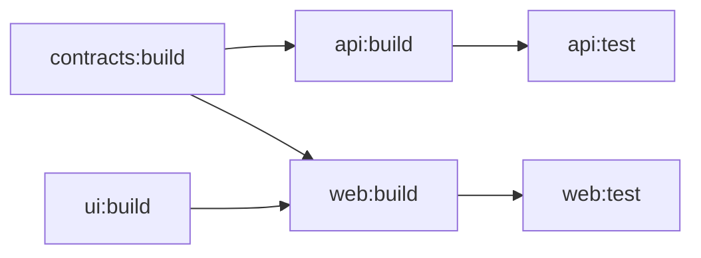

# Task Runners and Caching

> Turborepo, Nx, and the single idea underneath both — a graph of tasks keyed by the hash of each task's declared inputs — plus what a remote cache is actually worth and why an undeclared input is a correctness bug, not a performance one.

---

## What is it?

A cached task runner sits on top of a [package-manager workspace](package-manager-workspaces.md) and adds two things it lacks: knowledge of which tasks depend on which, and the ability to skip a task whose result it already has.

This is rung 2 of the [tooling ladder](overview.md). The workspace below it resolves *dependencies*; this rung schedules *work*.

---

## Why does it matter?

At rung 1, `pnpm -r build` builds every package every time. That is correct and it is fine until it is not — and the point where it stops being fine arrives suddenly, because build time grows with the number of packages while your patience does not.

A task runner changes the question from "build everything" to "build what is not already built". The mechanism that answers it — content hashing over declared inputs — is also what answers "what did this change affect", which is what [Monorepo CI](../monorepo-ci.md) needs. One abstraction, two payoffs.

The mechanism is also where the subtle failure lives, and that is the part worth understanding before adopting any of these tools.

---

## How it works

### The task graph

You declare tasks and the dependencies between them. The tool derives the execution order and the parallelism.



The notation that trips people up is `^`. In `dependsOn: ["^build"]`, the caret means *the `build` task of this package's dependencies*, not of this package. So `api:test` depending on `^build` waits for `contracts:build`, not for `api:build`. Writing `"build"` without the caret means this package's own build. Most misconfigured pipelines are one missing caret.

### Input hashing — the actual mechanism

Before running a task, the tool computes a hash over everything declared to affect its output:

- the package's own source files, filtered by the task's `inputs` patterns
- the **output hashes of its dependency tasks** — this is what makes the hash transitive
- the lockfile
- environment variables the task declares it reads
- the tool's own version and the task's configuration

If that hash has been seen before, the recorded outputs are restored from the cache and the task never runs.

Now the failure mode, stated plainly:

> **An input you did not declare does not change the hash. A cache hit then serves a stale artefact, and the build is silently wrong — and stays wrong across retries, because the hash is still the same.**

Concretely: a build step that reads a config file outside its `inputs` patterns, or branches on an environment variable it never declared, will keep serving yesterday's output after you change that file or variable. This is not a performance bug. It is a correctness bug produced by a tool you adopted for speed, and it is the single strongest argument for the hermetic model at rung 3 ([Bazel](bazel.md)), which enumerates everything and sandboxes execution so an undeclared input cannot be read at all.

Practical defence at this rung: keep `inputs` honest, declare every environment variable a task reads, and treat a cache hit that surprises you as a configuration bug rather than a fluke.

### Local versus remote cache

The **local cache** is a directory of task outputs keyed by hash. It makes rebuilding after a branch switch nearly free, and it is the part that pays immediately.

The **remote cache** is the same key-value store, shared. CI populates it, your machine reads from it, and colleagues share both. It is the headline feature of every tool in this category.

For a solo developer it is close to worthless. One machine has nothing to share with itself that the local cache does not already cover. The one genuine exception is **laptop ↔ CI**: if CI has already built a commit, your machine can restore rather than rebuild. Real, modest, and not on its own a reason to adopt anything.

Note the hosting question while you are here. Turborepo's remote cache is Vercel-hosted by default, Nx's is Nx Cloud; both support self-hosting, and both are a dependency on someone else's availability if you do not.

### Affected detection

Once the graph exists, "what changed" is a graph query rather than a path match:

```bash
turbo run test --filter='...[origin/main]'
nx affected --target=test --base=origin/main
```

The tool diffs against the base, maps changed files to packages, then walks the graph forward to every dependent. That is why it is correct where hand-written [path filters](../monorepo-ci.md) rot: the dependency edges are derived from the manifests, not maintained in a YAML file by hand.

### Turborepo versus Nx

The choice most readers actually face. They occupy the same rung and answer it differently.

| | Turborepo | Nx |
|---|---|---|
| **Mental model** | A cache in front of the scripts you already have | A workspace framework with a build system inside |
| **Config surface** | One `turbo.json`; tasks map to existing `package.json` scripts | `nx.json`, project configs, plugins; a graph largely inferred |
| **Code generation** | None | Generators for apps, libraries, components — a major selling point |
| **Boundary enforcement** | None built in | Project tags plus a lint rule — genuinely useful |
| **Non-JS support** | Effectively none | Plugins exist; JS remains the centre of gravity |
| **What you lose on removal** | Nothing — `pnpm -r build` still works | Potentially a lot: generators, inferred targets, plugin-owned config |
| **Migration cost** | An afternoon | A project |

That last row is the one to weigh. Turborepo is designed to be removable: it runs your existing scripts, so deleting `turbo.json` leaves a working repository. Nx tends to own more — plugins infer targets, generators shape the code, and the repository gradually assumes Nx is present. That is a fair trade for what Nx gives back at scale, and a bad trade at three packages.

**The verdict for this section's reader: Turborepo if you want a cache; Nx if you want a framework. Solo or at two or three people, you want a cache.**

### The others

| Tool | Positioning |
|---|---|
| **Moon** | Rust-based, multi-language by design, more explicit task definitions. Credible; small ecosystem. |
| **Lage** | Microsoft's lighter runner, similar in spirit to Turborepo. |
| **Rush** | The heavyweight JS monorepo manager — strict policies, phased builds, aimed at large organisations. |
| **`make` / `just`** | A dependency graph with no content hashing and no cache, but zero maintenance and no upgrade treadmill. Genuinely the right answer more often than the category admits. |

### What this rung does not give you

- **No hermeticity.** Tasks run in your normal environment and can read anything on disk.
- **No cross-language correctness.** These tools understand JavaScript packages well and everything else approximately.
- **No remote execution.** Work is distributed across your machines, not to a build farm.

Needing any of those is the climb signal to rung 3 — and needing them is rarer than wanting them.

---

## Examples

A complete `turbo.json` for a three-package repository:

```json
{
  "$schema": "https://turborepo.com/schema.json",
  "tasks": {
    "build": {
      "dependsOn": ["^build"],
      "inputs": ["src/**", "tsconfig.json", "package.json"],
      "outputs": ["dist/**"]
    },
    "test": {
      "dependsOn": ["build"],
      "inputs": ["src/**", "test/**"],
      "outputs": []
    },
    "dev": {
      "cache": false,
      "persistent": true
    }
  }
}
```

Four details carry the weight. `^build` waits for dependencies' builds. `inputs` decides the hash — anything omitted is invisible to it. `outputs` is what gets cached and restored; omit it on `build` and a cache hit restores nothing. And `dev` sets `cache: false` because a long-running server has no meaningful output to cache.

The Nx equivalent, showing the difference in posture:

```json
{
  "targetDefaults": {
    "build": {
      "dependsOn": ["^build"],
      "inputs": ["production", "^production"],
      "cache": true
    }
  },
  "namedInputs": {
    "production": ["{projectRoot}/src/**/*", "!{projectRoot}/**/*.spec.ts"]
  }
}
```

Nx names input sets and reuses them; Turborepo lists globs per task. Nx also adds the boundary rule Turborepo lacks:

```json
// project.json — tags feed an eslint rule that enforces the dependency direction
{ "tags": ["scope:shared", "type:util"] }
```

And in CI, the affected query replaces every hand-written path filter:

```bash
pnpm turbo run build test --filter='...[origin/main]'
```

---

## When to use

- A workspace where full build or test time has grown enough that you have started avoiding running it.
- Repositories with enough interdependent packages that maintaining CI path filters by hand has started producing mistakes.
- Teams of two or more sharing a remote cache, where CI work genuinely gets reused across machines.
- Any repository where you want affected detection derived from the dependency graph rather than declared in YAML.

## When NOT to use

- **Nx in a two-package repository** — you are adopting a framework to solve a problem the framework's own overhead exceeds; Turborepo or nothing.
- **A remote cache before you have a second machine** — one developer with one laptop shares work with nobody, and the local cache already covers branch switching.
- **Trusting the cache when tasks are not deterministic** — a task that reads undeclared files or embeds a timestamp will serve wrong output on a hit, and the error survives retries.
- **Omitting `outputs` on a cacheable task** — the task is then "cached" but restores nothing, so every hit still leaves you without the artefact.
- **Adopting a runner to fix a slow individual build** — if one package takes four minutes to compile, caching hides it from repeat runs and changes nothing about the first one; fix the build.
- **Expecting it to span a non-JS side of the repository** — a Go or Swift project will not participate meaningfully; that is rung 3's job, if it is anyone's.

---

## References

- [Turborepo — Caching](https://turborepo.com/docs/crafting-your-repository/caching) and [Configuring tasks](https://turborepo.com/docs/crafting-your-repository/configuring-tasks).
- [Nx — What is Nx?](https://nx.dev/getting-started/intro) and [Task caching](https://nx.dev/features/cache-task-results).
- Mokhov, Andrey, Neil Mitchell, and Simon Peyton Jones. [Build Systems à la Carte](https://www.microsoft.com/en-us/research/uploads/prod/2018/03/build-systems.pdf). ICFP 2018 — the formal treatment of rebuild strategies and why input enumeration determines correctness.
- [moonrepo documentation](https://moonrepo.dev/docs) — the multi-language alternative.
- [Rush — What is Rush?](https://rushjs.io/pages/intro/welcome/) — the heavyweight end of the category.
