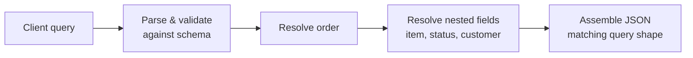

# GraphQL

> A query language and runtime for APIs where the server exposes a typed schema through a single endpoint and each client asks for exactly the fields it needs — no more, no less.

---

## What is it?

**GraphQL** flips the usual API model: instead of the server deciding what each endpoint returns, the **client** sends a query describing the exact shape of the data it wants, and the server responds with precisely that shape. There is typically **one endpoint** (`/graphql`), and everything the API can do is described by a strongly-typed **schema**.

It was created at Facebook to serve mobile clients that each needed different slices of a rich, interconnected data graph without a proliferation of custom REST endpoints.

## Why does it matter?

GraphQL targets two specific pains of [REST](rest.md):

- **Over-fetching** — a REST endpoint returns a fixed representation, often more than a given screen needs. GraphQL returns only the requested fields.
- **Under-fetching / round-trips** — assembling a view from REST often means several requests (`/orders/42`, then `/orders/42/items`, then `/customers/7`). A single GraphQL query can fetch the whole graph in one round-trip.

On top of that:

- **Typed schema** — the schema is a machine-readable contract that powers autocomplete, validation, and tooling (GraphiQL, code generation).
- **Evolvable** — add fields without versioning; deprecate old ones with annotations, since clients only pull what they ask for.

The costs are real: caching is harder than REST's URL-based HTTP caching; a naive resolver graph invites the **N+1 query** problem (mitigated with batching/`DataLoader`); arbitrary client queries can be expensive, so you need depth/complexity limits; and the server is more complex to build.

## How it works

The server defines a **schema** of types and the queries/mutations available. A **resolver** function backs each field, fetching or computing its value. The client sends a query; the engine walks it, calls resolvers, and returns a JSON tree matching the query shape.

```
Schema (server)                 Query (client)              Response (only asked fields)
──────────────────────────      ────────────────────────    ────────────────────────────
type Order {                    {                           {
  id: ID!                         order(id: "42") {           "order": {
  item: String!                     item                        "item": "book",
  status: String!                   status                      "status": "shipped"
  customer: Customer                                          }
}                                 }                           }
type Customer { name: String! } }
```



Key concepts:

- **Query** — read data (analogous to `GET`). **Mutation** — change data (analogous to `POST/PUT/DELETE`). **Subscription** — real-time updates, usually over [WebSocket](../http/websocket.md).
- **Single endpoint** — everything goes through `POST /graphql`; the operation is in the body, not the URL.
- **Resolvers** — one per field; nested fields resolve independently, which is powerful but is where the N+1 problem appears.
- **Introspection** — clients can query the schema itself, enabling rich tooling.

## Examples

A minimal schema with one query (`order`) and its resolver, wired into a server. The examples name each ecosystem's common GraphQL library. Payload fields are `id`, `item`, `status` — never address-shaped values.

### Go — `graphql-go/graphql`

```go
orderType := graphql.NewObject(graphql.ObjectConfig{
    Name: "Order",
    Fields: graphql.Fields{
        "id":     &graphql.Field{Type: graphql.String},
        "item":   &graphql.Field{Type: graphql.String},
        "status": &graphql.Field{Type: graphql.String},
    },
})
schema, _ := graphql.NewSchema(graphql.SchemaConfig{
    Query: graphql.NewObject(graphql.ObjectConfig{
        Name: "Query",
        Fields: graphql.Fields{
            "order": &graphql.Field{
                Type: orderType,
                Args: graphql.FieldConfigArgument{"id": &graphql.ArgumentConfig{Type: graphql.String}},
                Resolve: func(p graphql.ResolveParams) (any, error) {
                    return map[string]string{"id": p.Args["id"].(string), "item": "book", "status": "shipped"}, nil
                },
            },
        },
    }),
})
_ = schema // serve via graphql.Do(...) behind an HTTP handler
```

### TypeScript (Node.js — Apollo Server)

```ts
import { ApolloServer } from "@apollo/server";
import { startStandaloneServer } from "@apollo/server/standalone";

const typeDefs = `
  type Order { id: ID!, item: String!, status: String! }
  type Query { order(id: ID!): Order }
`;

const resolvers = {
  Query: {
    order: (_: unknown, args: { id: string }) => ({ id: args.id, item: "book", status: "shipped" }),
  },
};

const server = new ApolloServer({ typeDefs, resolvers });
await startStandaloneServer(server, { listen: { port: 8080 } });
```

### Java — `graphql-java` (Spring for GraphQL)

```graphql
# schema.graphqls
type Order { id: ID!, item: String!, status: String! }
type Query { order(id: ID!): Order }
```

```java
@Controller
class OrderGraphQlController {
    // Maps to Query.order — Spring for GraphQL wires it from the schema
    @QueryMapping
    Order order(@Argument String id) {
        return new Order(id, "book", "shipped");
    }
}

record Order(String id, String item, String status) {}
```

### C# — Hot Chocolate

```csharp
// Query type — each method is a resolver
public class Query
{
    public Order GetOrder(string id) => new(id, "book", "shipped");
}

public record Order(string Id, string Item, string Status);

// Program.cs
var builder = WebApplication.CreateBuilder(args);
builder.Services.AddGraphQLServer().AddQueryType<Query>();
var app = builder.Build();
app.MapGraphQL(); // serves POST /graphql
app.Run();
```

## When to use

- **Many clients with different data needs** (web, iOS, Android) hitting a rich, interconnected graph — each pulls exactly its slice.
- **Aggregating multiple back-ends** behind one typed schema (a graph/BFF layer).
- **Rapidly evolving front-ends** where adding fields without versioning and strong tooling speed development.

## When NOT to use

- **Simple, resource-shaped APIs** where REST is less machinery for the same result.
- **Heavily cache-dependent, read-heavy** public APIs — REST's HTTP/URL caching is simpler and CDN-friendly.
- **High-performance internal RPC** with fixed contracts — [gRPC](grpc.md) is faster and stricter.
- When you can't invest in **query-cost limits and batching** — unbounded client queries and N+1 resolvers can overwhelm back-ends.

## References

- [GraphQL — Official site and specification](https://graphql.org/learn/) — language, schema, and execution model.
- [GraphQL Specification](https://spec.graphql.org/) — the normative spec.
- [Apollo — Principled GraphQL / best practices](https://www.apollographql.com/docs/) — caching, batching, and schema design guidance.
