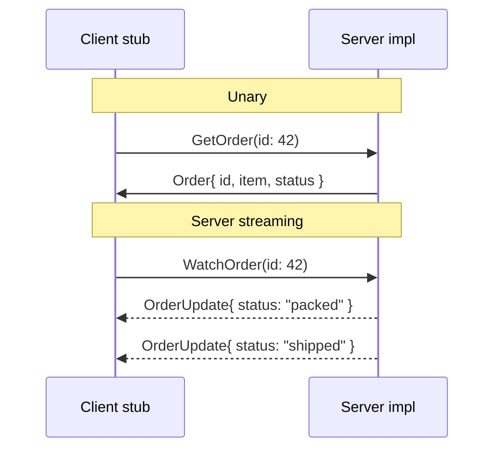

# gRPC

> A contract-first RPC framework that generates client and server code from a Protobuf schema and exchanges compact binary messages over HTTP/2, with first-class support for streaming in both directions.

---

## What is it?

**gRPC** lets you call a method on a remote server as if it were a local function. You define the service and its messages once in a `.proto` file; a code generator produces strongly-typed client stubs and server interfaces in each language. Calls travel as compact binary **Protocol Buffers** over [HTTP/2](../http/http.md), which also gives gRPC efficient multiplexing and built-in streaming.

It is the go-to style for **internal, high-performance service-to-service** communication in polyglot microservice systems.

## Why does it matter?

Compared to [REST](rest.md) over JSON, gRPC optimizes for machine-to-machine efficiency and safety:

- **Contract-first and strongly typed** — the `.proto` is the single source of truth. Client and server can't drift, and breaking changes are caught at build time.
- **Compact and fast** — Protobuf binary encoding is smaller and faster to parse than JSON; over HTTP/2, many calls multiplex on one connection.
- **Streaming built in** — server-streaming, client-streaming, and bidirectional streaming are native call types, not bolted-on techniques.
- **Polyglot** — generate idiomatic clients/servers for Go, Java, C#, Node, Python, and more from the same contract.

The trade-offs: it is not human-readable on the wire, needs a build/codegen step, and browsers cannot speak raw gRPC (they need a proxy layer, gRPC-Web). That is why public-facing APIs often stay on REST/GraphQL while internal ones use gRPC.

## How it works

You write a `.proto`, generate code, and implement/consume the generated types. gRPC defines **four call types**:

```
Unary                 client 1 request  → server 1 response
Server streaming      client 1 request  → server stream of responses
Client streaming      client stream     → server 1 response
Bidirectional         client stream    ⇄  server stream   (both at once, over HTTP/2)
```



The shared contract:

```protobuf
syntax = "proto3";
package orders;

service OrderService {
  rpc GetOrder (GetOrderRequest) returns (Order);
}

message GetOrderRequest { string id = 1; }
message Order { string id = 1; string item = 2; string status = 3; }
```

From this, each language's `protoc` plugin generates the messages and a client stub + server base class. The examples below implement/consume the unary `GetOrder`.

## Examples

### Go

```go
// Server: implement the generated OrderServiceServer
type server struct{ orders.UnimplementedOrderServiceServer }

func (s *server) GetOrder(ctx context.Context, req *orders.GetOrderRequest) (*orders.Order, error) {
    return &orders.Order{Id: req.Id, Item: "book", Status: "shipped"}, nil
}

func main() {
    lis, _ := net.Listen("tcp", ":50051")
    s := grpc.NewServer()
    orders.RegisterOrderServiceServer(s, &server{})
    s.Serve(lis)
}

// Client: call it through the generated stub
conn, _ := grpc.NewClient("localhost:50051", grpc.WithTransportCredentials(insecure.NewCredentials()))
client := orders.NewOrderServiceClient(conn)
order, _ := client.GetOrder(ctx, &orders.GetOrderRequest{Id: "42"})
fmt.Println(order.Status) // "shipped"
```

### TypeScript (Node.js — `@grpc/grpc-js`)

```ts
import { credentials, Server, ServerCredentials } from "@grpc/grpc-js";
// `orders` is generated from the .proto (e.g. via ts-proto or proto-loader)

// Server
const server = new Server();
server.addService(OrderService, {
  getOrder: (call, callback) =>
    callback(null, { id: call.request.id, item: "book", status: "shipped" }),
});
server.bindAsync("0.0.0.0:50051", ServerCredentials.createInsecure(), () => {});

// Client
const client = new OrderServiceClient("localhost:50051", credentials.createInsecure());
client.getOrder({ id: "42" }, (_err, order) => console.log(order.status)); // "shipped"
```

### Java

```java
// Server: extend the generated OrderServiceImplBase
class OrderServiceImpl extends OrderServiceGrpc.OrderServiceImplBase {
    @Override
    public void getOrder(GetOrderRequest req, StreamObserver<Order> obs) {
        obs.onNext(Order.newBuilder().setId(req.getId()).setItem("book").setStatus("shipped").build());
        obs.onCompleted();
    }
}

// Start server
Server server = ServerBuilder.forPort(50051).addService(new OrderServiceImpl()).build().start();

// Client: use the generated blocking stub
var channel = ManagedChannelBuilder.forAddress("localhost", 50051).usePlaintext().build();
var stub = OrderServiceGrpc.newBlockingStub(channel);
Order order = stub.getOrder(GetOrderRequest.newBuilder().setId("42").build());
System.out.println(order.getStatus()); // "shipped"
```

### C#

```csharp
// Server: override the generated OrderService.OrderServiceBase
public class OrderServiceImpl : OrderService.OrderServiceBase
{
    public override Task<Order> GetOrder(GetOrderRequest req, ServerCallContext ctx) =>
        Task.FromResult(new Order { Id = req.Id, Item = "book", Status = "shipped" });
}
// In Program.cs: builder.Services.AddGrpc(); app.MapGrpcService<OrderServiceImpl>();

// Client: use the generated typed client
using var channel = GrpcChannel.ForAddress("http://localhost:50051");
var client = new OrderService.OrderServiceClient(channel);
var order = await client.GetOrderAsync(new GetOrderRequest { Id = "42" });
Console.WriteLine(order.Status); // "shipped"
```

## When to use

- **Internal service-to-service** calls in a microservice system, especially polyglot ones — one contract, generated clients everywhere.
- **Performance-sensitive** paths where JSON overhead and parsing cost matter.
- **Streaming RPCs** — telemetry, chat backends, live updates — where native bidirectional streaming beats hand-rolled solutions.
- When you want the **contract enforced by the compiler**, not by convention.

## When NOT to use

- **Public/browser-facing APIs** — browsers can't call raw gRPC (needs gRPC-Web + a proxy); [REST](rest.md) or [GraphQL](graphql.md) are friendlier.
- **Human exploration/debugging** — the binary wire format isn't `curl`-friendly; REST is easier to poke at.
- **Simple CRUD** with no performance pressure — the codegen/build ceremony isn't worth it over REST.

## References

- [gRPC — Official documentation](https://grpc.io/docs/) — concepts, tutorials, and language guides.
- [Protocol Buffers — Language guide (proto3)](https://protobuf.dev/programming-guides/proto3/) — the schema language.
- [gRPC over HTTP/2](https://github.com/grpc/grpc/blob/master/doc/PROTOCOL-HTTP2.md) — how gRPC maps calls onto HTTP/2 frames.
