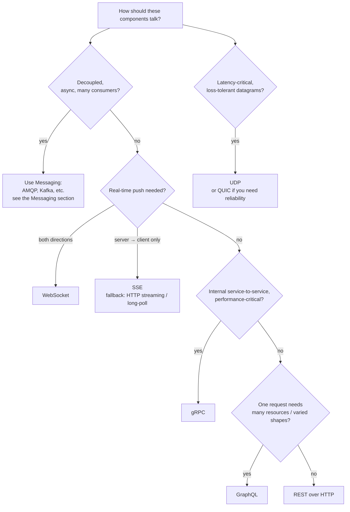

# Communication Protocols — Comparison

> A side-by-side decision guide: match the shape of your problem — direction, latency, contract, reach — to the right protocol, and know when the answer is actually asynchronous messaging.

---

## What is it?

This article compares the protocols covered in this section — [TCP](transport/tcp.md), [UDP](transport/udp.md), [QUIC](transport/quic.md), [HTTP](http/http.md), [WebSocket](http/websocket.md), [SSE](http/sse.md), [HTTP streaming](http/streaming.md), [REST](api-styles/rest.md), [gRPC](api-styles/grpc.md), and [GraphQL](api-styles/graphql.md) — across the axes that actually drive the choice. It is a decision guide, not a new protocol.

## Why does it matter?

Most protocol mistakes are mismatches: WebSocket where SSE would do, gRPC exposed to browsers, polling where push was needed, or a synchronous call where the systems should have been decoupled with messaging. Choosing along the right axes the first time avoids expensive rework, because the choice leaks into clients, load balancers, caching, and observability.

## How it works

### Comparison table

| Protocol | Layer | Direction | Model | Transport | Payload | Best for |
|---|---|---|---|---|---|---|
| **TCP** | Transport | bidirectional stream | reliable byte stream | IP | bytes | anything needing ordered, reliable delivery |
| **UDP** | Transport | fire-and-forget | connectionless datagrams | IP | bytes | media, games, DNS, telemetry |
| **QUIC** | Transport | multiplexed streams | reliable, per-stream | UDP | bytes | HTTP/3, mobile, lossy networks |
| **HTTP** | Application | request/response | stateless req/res | TCP or QUIC | text/binary | the web, most APIs |
| **REST** | API style | request/response | resources + verbs | HTTP | usually JSON | public/CRUD APIs, caching |
| **gRPC** | API style | req/res + streaming | RPC, contract-first | HTTP/2 | Protobuf (binary) | internal service-to-service |
| **GraphQL** | API style | request/response | typed query language | HTTP | JSON | many clients, rich data graph |
| **WebSocket** | Application | full-duplex | persistent bidirectional | TCP (via HTTP upgrade) | text/binary | chat, collaboration, games |
| **SSE** | Application | server → client | one-way event stream | HTTP | text | notifications, live feeds, token streams |
| **HTTP streaming** | Application | server → client | chunked / long-poll | HTTP | text/binary | progressive responses, fallback push |

### Decision flow



### When the answer is messaging, not a protocol

If the components should be **decoupled in time** — the producer shouldn't wait for or even know about the consumers, work should survive a consumer being offline, or many consumers process the same events — then the right answer is **asynchronous messaging**, not a request/response or streaming protocol. That is a different toolbox (AMQP, MQTT, Kafka, SQS, …) covered in the [Messaging section](../messaging/overview.md) and its [broker comparison](../messaging/comparison.md). This section is about **direct** communication between endpoints.

## Examples

The same need — *"notify clients when an order's status changes"* — solved four ways, with the trade-off each carries:

```
Approach          How it works                          Trade-off
────────────────  ────────────────────────────────────  ─────────────────────────────
REST polling      client GETs /orders/42 every N sec     simple; wasteful + laggy
SSE               server streams status events over HTTP  ideal one-way push; text only
WebSocket         persistent full-duplex channel          overkill unless client also sends
Messaging         publish "order.updated"; services       decoupled + durable; needs a
                  subscribe via a broker                   broker, eventual delivery
```

If clients only *read* updates, SSE wins on simplicity. If a dashboard also *sends* commands, WebSocket. If many internal services react to the change independently, publish an event to a broker (messaging).

## When to use

- Use this guide **before committing** to how a new API, real-time feature, or service call communicates.
- Revisit it when an existing choice hurts — e.g. polling load is high (→ SSE), or a REST view needs too many round-trips (→ GraphQL/gRPC).

## When NOT to use

- Don't over-optimize a **simple internal CRUD** service — REST over HTTP is the boring, correct default; reach for gRPC/GraphQL/WebSocket only for a concrete reason.
- Don't use this section's protocols to force **synchronous coupling** where the domain is naturally asynchronous — use [messaging](../messaging/overview.md) instead.

## References

- [MDN — An overview of HTTP](https://developer.mozilla.org/en-US/docs/Web/HTTP/Overview) — grounding for the HTTP-family choices.
- [gRPC — Core concepts](https://grpc.io/docs/what-is-grpc/core-concepts/) and [GraphQL — Thinking in graphs](https://graphql.org/learn/thinking-in-graphs/) — the two API-style alternatives to REST.
- [Messaging — Broker Comparison](../messaging/comparison.md) — the companion decision guide for when the answer is asynchronous messaging.
