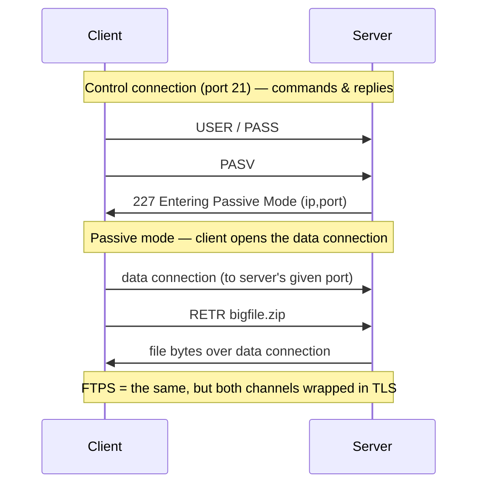

# FTP & FTPS — File Transfer Protocol

> The classic 1971 protocol for transferring files using two separate connections — one for commands, one for data — and its TLS-secured variant, FTPS.

---

## What is it?

**FTP** is one of the internet's oldest protocols, designed to upload and download files between a client and a server. Its defining trait is a **two-channel** design: a **control connection** (port 21) carries commands and replies, while a separate **data connection** carries the actual file bytes. Plain FTP sends everything — including your username and password — in cleartext.

**FTPS** is FTP with **TLS** bolted on, encrypting both channels. It comes in two flavors: *implicit* (TLS from the start, historically port 990) and *explicit* (the client upgrades the plaintext control connection to TLS via the `AUTH TLS` command). FTPS should not be confused with [SFTP](sftp.md), which is a completely different protocol built on SSH.

## Why does it matter?

FTP predates the web and is still entrenched in shared hosting, business-to-business file exchange, EDI, and countless legacy integrations — so engineers still meet it regularly. Understanding its **active vs. passive** modes explains a huge share of real-world FTP pain: transfers that connect but then hang, or fail behind NAT and firewalls, almost always trace back to how the data channel is opened.

It also matters as a cautionary tale. Plain FTP's cleartext credentials make it unsuitable for untrusted networks, and its dual-connection model is awkward for modern firewalls — both reasons the industry largely moved to [SFTP](sftp.md).

## How it works

The client keeps a persistent **control connection** open and issues commands (`USER`, `PASS`, `LIST`, `RETR`, `STOR`). Each file transfer or directory listing opens a **separate data connection**, and *who* initiates that data connection is the crux:

- **Active mode** — the client tells the server which port to connect back to, and the **server** opens the data connection *to the client*. This breaks when the client is behind NAT/a firewall, because the inbound connection is usually blocked.
- **Passive mode** — the server opens a listening port and tells the client to connect to it, so the **client** initiates *both* connections outbound. This is firewall-friendly and the modern default.



Two more details worth knowing: FTP has an **ASCII vs. binary** transfer mode (ASCII mode rewrites line endings and will corrupt binary files if misused), and FTPS's separate encrypted data channel can still confuse NAT devices that try to inspect the control channel.

## Examples

Classic interactive FTP session and a scripted transfer:

```bash
# Interactive session
ftp ftp.example.com
# then, at the ftp> prompt:
#   passive        (switch to passive mode)
#   binary         (avoid line-ending corruption)
#   get report.pdf
#   put upload.zip
#   bye
```

Using `lftp` for FTPS (explicit TLS) and `curl` for one-shot transfers:

```bash
# Force TLS with lftp (FTPS, explicit)
lftp -e 'set ftp:ssl-force true; set ftp:ssl-protect-data true' \
     -u user ftps://ftp.example.com

# One-shot download over FTPS with curl
curl --ssl-reqd -u user ftp://ftp.example.com/report.pdf -o report.pdf
```

## When to use

- **Interoperating with legacy systems** or hosting providers that only speak FTP/FTPS.
- **Business-to-business file exchange** where a partner mandates FTPS as the agreed transport.
- **Bulk anonymous downloads** from public FTP mirrors that still exist.

## When NOT to use

- **Plain FTP on any untrusted network** — cleartext credentials and data; if you must use FTP-family, use FTPS, and prefer [SFTP](sftp.md) where possible.
- **Environments with strict NAT/firewalls** — the dual-connection model is fragile; [SFTP](sftp.md)'s single port is far simpler to operate.
- **New projects** — reach for [SFTP](sftp.md) or [rsync](rsync.md) instead; there is rarely a reason to choose FTP for greenfield work.

## References

- [IETF RFC 959 — File Transfer Protocol (FTP)](https://www.rfc-editor.org/rfc/rfc959) — the core specification.
- [IETF RFC 4217 — Securing FTP with TLS](https://www.rfc-editor.org/rfc/rfc4217) — the FTPS (explicit TLS) standard.
- [IETF RFC 2428 — FTP Extensions for IPv6 and NATs](https://www.rfc-editor.org/rfc/rfc2428) — background on passive-mode and NAT interaction.
