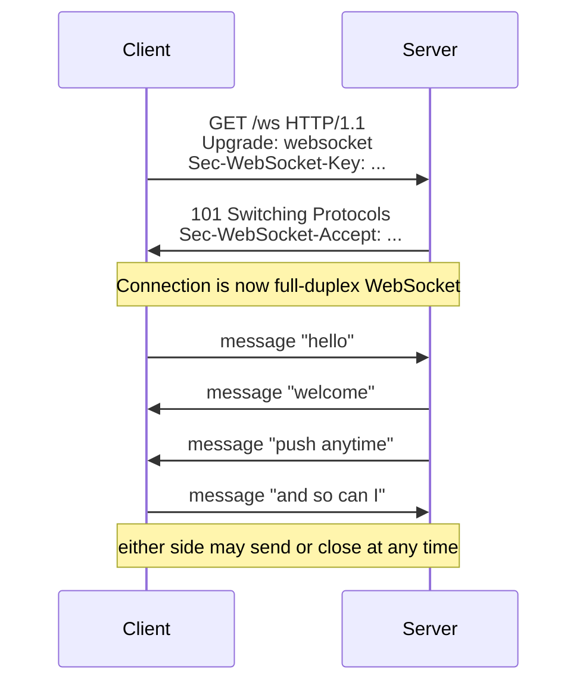

# WebSocket

> A full-duplex communication channel over a single long-lived TCP connection: after an HTTP handshake upgrades the connection, both client and server can send messages at any time.

---

## What is it?

**WebSocket** gives you a persistent, two-way pipe between client and server. Unlike [HTTP](http.md), where the client must ask before the server can answer, either side can push a message whenever it wants, with very low per-message overhead. It starts life as an HTTP request that is "upgraded" into a WebSocket connection, then stops being HTTP entirely.

It is the standard choice for **interactive, real-time** features: chat, collaborative editing, multiplayer game state, live dashboards, and trading tickers.

## Why does it matter?

Before WebSocket, simulating server push over HTTP meant hacks — repeated polling or long-polling (see [HTTP streaming](streaming.md)) — each with latency, overhead, or scaling problems. WebSocket solves the underlying need directly:

- **Bidirectional** — the server can push without the client asking; the client can send without opening a new request.
- **Low overhead** — after the handshake, messages are small framed payloads, not full HTTP requests with headers each time.
- **Low latency** — one connection stays open, so there is no per-message connection setup.

The trade-off is that a persistent, stateful connection is harder to scale and operate than stateless HTTP, and it is overkill when you only need one direction.

## How it works

A WebSocket connection begins as a normal HTTP request with an `Upgrade` header. If the server agrees (`101 Switching Protocols`), the same TCP connection is repurposed for WebSocket framing:



Key points:

- **Upgrade handshake** — reuses HTTP so it works through the same ports (80/443) and many proxies.
- **Frames** — after upgrade, data is exchanged as lightweight frames (text or binary), not HTTP messages.
- **Full-duplex** — no request/response coupling; messages flow independently in both directions.
- **Stateful** — the connection (and often per-connection application state) lives for its whole duration, which affects load balancing and horizontal scaling.
- **`wss://`** — WebSocket over TLS, the secure form, analogous to `https://`.

## Examples

A tiny echo/greeting server plus a client. WebSocket is not in most standard libraries, so each example names the idiomatic library.

### Go — `nhooyr.io/websocket`

```go
// Server
http.HandleFunc("/ws", func(w http.ResponseWriter, r *http.Request) {
    c, _ := websocket.Accept(w, r, nil)
    defer c.Close(websocket.StatusNormalClosure, "")
    for {
        _, data, err := c.Read(r.Context())
        if err != nil { return }
        c.Write(r.Context(), websocket.MessageText, append([]byte("echo: "), data...))
    }
})
http.ListenAndServe(":8080", nil)

// Client
c, _, _ := websocket.Dial(ctx, "ws://localhost:8080/ws", nil)
defer c.Close(websocket.StatusNormalClosure, "")
c.Write(ctx, websocket.MessageText, []byte("hello"))
_, reply, _ := c.Read(ctx)
fmt.Println(string(reply)) // "echo: hello"
```

### TypeScript (Node.js) — `ws`

```ts
import { WebSocketServer, WebSocket } from "ws";

// Server
const wss = new WebSocketServer({ port: 8080 });
wss.on("connection", (socket) => {
  socket.on("message", (data) => socket.send(`echo: ${data}`));
});

// Client (browser uses the built-in WebSocket; Node uses `ws`)
const client = new WebSocket("ws://localhost:8080");
client.on("open", () => client.send("hello"));
client.on("message", (data) => {
  console.log(data.toString()); // "echo: hello"
  client.close();
});
```

### Java — Jakarta WebSocket (JSR 356)

```java
// Server endpoint
@ServerEndpoint("/ws")
public class EchoEndpoint {
    @OnMessage
    public void onMessage(String message, Session session) throws IOException {
        session.getBasicRemote().sendText("echo: " + message);
    }
}

// Client endpoint
@ClientEndpoint
public class EchoClient {
    @OnMessage
    public void onMessage(String message) {
        System.out.println(message); // "echo: hello"
    }
}
// container.connectToServer(EchoClient.class, URI.create("ws://localhost:8080/ws"));
// then session.getBasicRemote().sendText("hello");
```

### C# — ASP.NET Core WebSockets

```csharp
// Server
var app = WebApplication.Create();
app.UseWebSockets();
app.Map("/ws", async ctx =>
{
    using var socket = await ctx.WebSockets.AcceptWebSocketAsync();
    var buffer = new byte[1024];
    while (socket.State == WebSocketState.Open)
    {
        var result = await socket.ReceiveAsync(buffer, CancellationToken.None);
        var text = "echo: " + Encoding.UTF8.GetString(buffer, 0, result.Count);
        await socket.SendAsync(Encoding.UTF8.GetBytes(text),
            WebSocketMessageType.Text, true, CancellationToken.None);
    }
});
app.Run("http://localhost:8080");

// Client
using var client = new ClientWebSocket();
await client.ConnectAsync(new Uri("ws://localhost:8080/ws"), CancellationToken.None);
await client.SendAsync("hello"u8.ToArray(), WebSocketMessageType.Text, true, CancellationToken.None);
var buf = new byte[1024];
var res = await client.ReceiveAsync(buf, CancellationToken.None);
Console.WriteLine(Encoding.UTF8.GetString(buf, 0, res.Count)); // "echo: hello"
```

## When to use

- **Bidirectional, interactive real-time features** — chat, collaborative editing, multiplayer games, live customer support.
- **Low-latency client-to-server streams** — a trading client sending orders while receiving quotes on the same connection.
- When both sides need to **initiate messages** independently and frequently.

## When NOT to use

- **Only the server needs to push** (notifications, live feeds, progress) — [SSE](sse.md) is simpler, works over plain HTTP, and auto-reconnects.
- **Plain request/response** — use [HTTP](http.md); a persistent connection is unnecessary complexity.
- **Simple, low-frequency updates** where polling is fine — the operational cost of stateful connections isn't justified.

## References

- [IETF RFC 6455 — The WebSocket Protocol](https://www.rfc-editor.org/rfc/rfc6455) — the protocol specification, including the upgrade handshake.
- [MDN — The WebSocket API](https://developer.mozilla.org/en-US/docs/Web/API/WebSockets_API) — client-side usage and lifecycle.
- [MDN — Writing WebSocket servers](https://developer.mozilla.org/en-US/docs/Web/API/WebSockets_API/Writing_WebSocket_servers) — framing and handshake details.
