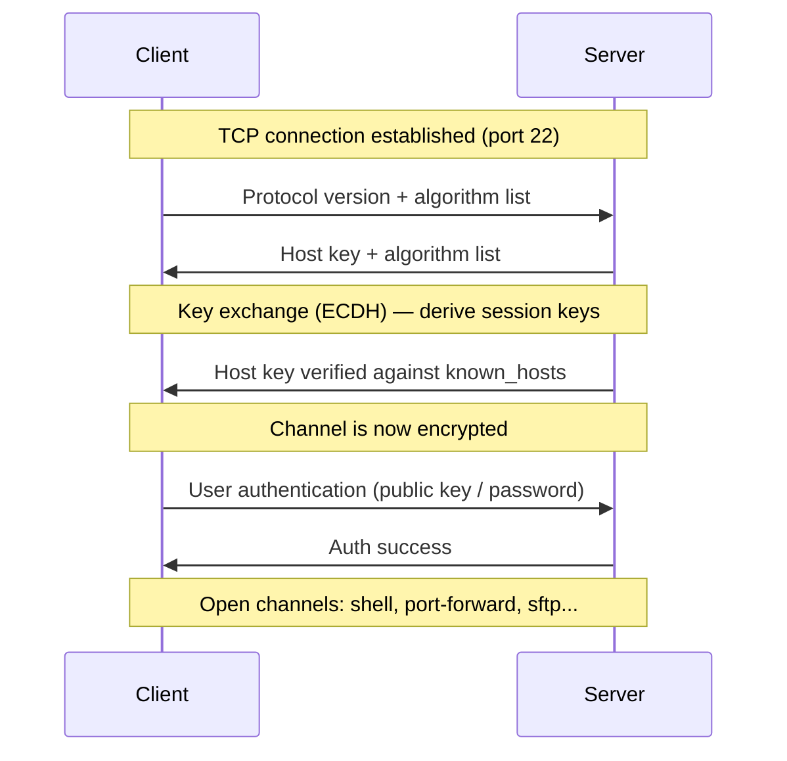

# SSH — Secure Shell

> An encrypted protocol for logging into and running commands on a remote machine, and the secure channel that file transfer and tunneling are built on top of.

---

## What is it?

**SSH** is the protocol you use to open a secure, encrypted session on a remote computer over an untrusted network. You type `ssh user@host`, authenticate, and get a shell on that machine — every keystroke and every byte of output travels encrypted. It replaced the older plaintext tools ([Telnet](telnet.md), `rlogin`, `rsh`) that sent passwords and commands in the clear.

SSH runs on TCP (port 22 by default) and does three things at once: it **encrypts** the connection, **authenticates** both the server and the user, and **verifies integrity** so nothing can be tampered with in transit. It is the de facto way to administer servers, and the foundation under Git-over-SSH, [SFTP](../file-transfer/sftp.md), and [SCP](../file-transfer/scp.md).

## Why does it matter?

Before SSH, remote administration meant sending credentials across the network as plaintext — trivial to sniff. SSH made secure remote access the default, and that single change underpins how the entire industry operates servers today.

Beyond login, SSH is a general-purpose secure channel. The same connection can carry file transfers, forward ports (tunneling a database connection through an encrypted hop), and multiplex several logical channels over one TCP connection. Its authentication model — **public-key cryptography** instead of passwords — is what makes safe, password-less automation (CI/CD, deploys, backups) possible. Understanding SSH's host-key model also explains the "The authenticity of host … can't be established" prompt everyone eventually meets.

## How it works

SSH is layered into three sub-protocols that run in sequence over one TCP connection:

1. **Transport layer** — negotiates algorithms, performs a **key exchange** (e.g. Diffie-Hellman / ECDH) to derive shared session keys, and authenticates the *server* via its **host key**. From here on, everything is encrypted.
2. **User authentication** — the *client* proves who it is, typically by **public key** (preferred) or password.
3. **Connection layer** — multiplexes independent **channels** (an interactive shell, a port forward, an SFTP subsystem) over the single encrypted pipe.



Key mechanisms:

- **Host keys** — the server identifies itself with a persistent key pair. The client remembers it in `~/.ssh/known_hosts`; a changed host key triggers a loud warning (possible man-in-the-middle).
- **Public-key authentication** — the user holds a private key; the server trusts the matching public key listed in its `~/.ssh/authorized_keys`. No password crosses the network.
- **Port forwarding / tunneling** — local (`-L`), remote (`-R`), and dynamic (`-D`, a SOCKS proxy) forwards tunnel arbitrary TCP traffic through the encrypted connection.
- **Subsystems** — SFTP is an SSH subsystem, which is why secure file transfer needs no extra port or daemon.

## Examples

Connect, generate a key, and install it for password-less login:

```bash
# Open an interactive shell on the remote host
ssh user@host

# Run a single command remotely and return
ssh user@host 'df -h /'

# Generate a modern key pair (Ed25519)
ssh-keygen -t ed25519 -C "workstation"

# Copy your public key to the server's authorized_keys
ssh-copy-id user@host
```

Tunnel a remote database port to your machine, and reuse host aliases via config:

```bash
# Forward local :5432 to the DB reachable from the remote host
ssh -L 5432:db.internal:5432 user@bastion
```

```sshconfig
# ~/.ssh/config — alias, key, and jump host
Host prod
    HostName 203.0.113.10
    User deploy
    IdentityFile ~/.ssh/id_ed25519
    ProxyJump bastion
```

Harden the server to require keys (in `/etc/ssh/sshd_config`):

```sshdconfig
PasswordAuthentication no
PermitRootLogin no
PubkeyAuthentication yes
```

## When to use

- **Interactive remote administration** — logging into servers to run commands.
- **Automation that needs credentials** — CI/CD, deploys, and backups using key-based, password-less auth.
- **Secure tunneling** — forwarding a database, dashboard, or any TCP service through an encrypted hop or bastion.
- **As the secure base** for file transfer ([SFTP](../file-transfer/sftp.md), [SCP](../file-transfer/scp.md)) and Git-over-SSH.

## When NOT to use

- **High-volume, incremental file synchronization** — SSH gives you the secure channel, but for syncing large trees efficiently use [rsync](../file-transfer/rsync.md) (which itself rides over SSH).
- **Password-based access exposed to the internet** — prefer public keys; password auth on port 22 invites brute-force attacks.
- **When a purpose-built application protocol already fits** — don't tunnel HTTP APIs over SSH when a proper reverse proxy or VPN is the right tool.

## References

- [IETF RFC 4251 — The Secure Shell (SSH) Protocol Architecture](https://www.rfc-editor.org/rfc/rfc4251) — the authoritative specification.
- [OpenSSH Manual Pages](https://www.openssh.com/manual.html) — `ssh`, `ssh-keygen`, `sshd_config`, and more.
- Barrett, Silverman, and Byrnes. *SSH, The Secure Shell: The Definitive Guide*. O'Reilly.
