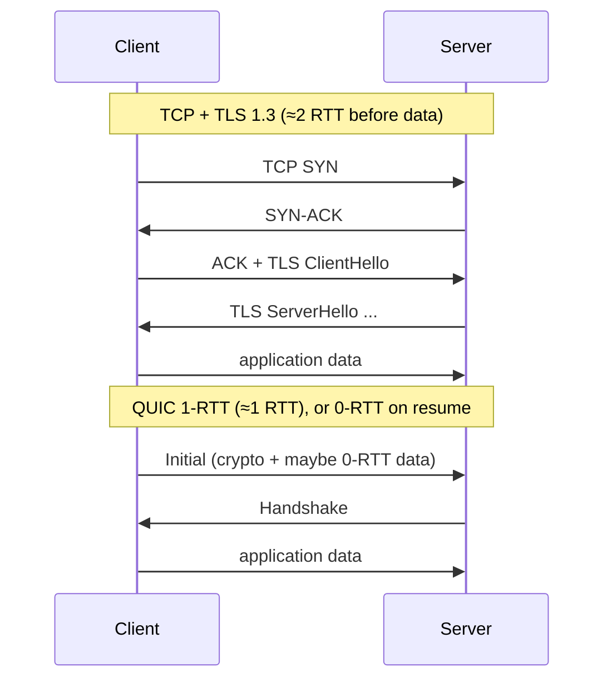

# QUIC

> A UDP-based transport that delivers TCP-grade reliability plus stream multiplexing, built-in TLS 1.3 encryption, and faster connection setup — the foundation of HTTP/3.

---

## What is it?

**QUIC** is a modern transport protocol that runs on top of [UDP](udp.md) but adds back the guarantees people rely on from [TCP](tcp.md) — reliable, ordered delivery — while fixing TCP's structural limitations. It carries multiple independent streams over one connection, encrypts everything by default, and establishes a secure connection in fewer round-trips.

Originally developed at Google and standardized by the IETF (RFC 9000), QUIC is the transport beneath **HTTP/3**. If you have loaded a Google or Cloudflare site recently, you have almost certainly used it.

## Why does it matter?

QUIC exists to solve concrete problems that TCP+TLS cannot:

- **Head-of-line blocking.** In HTTP/2 over TCP, many logical streams share one ordered byte stream; a single lost packet stalls *all* of them until it is retransmitted. QUIC gives each stream independent delivery, so a loss on one stream doesn't block the others.
- **Slow connection setup.** TCP needs a handshake, then TLS needs another — two or three round-trips before data flows. QUIC folds the transport and cryptographic handshakes together (1-RTT), and supports **0-RTT** resumption where a returning client sends data in the very first packet.
- **Connection migration.** A QUIC connection is identified by a connection ID, not the IP/port 4-tuple. When your phone switches from Wi-Fi to cellular, the connection survives instead of breaking.
- **Encryption by default.** TLS 1.3 is built in, not bolted on — there is no unencrypted QUIC.

## How it works

QUIC lives in **user space** (usually implemented in a library, not the OS kernel), on top of UDP. Because UDP is a thin best-effort layer, QUIC is free to implement its own reliability, ordering, and congestion control — per stream, not per connection.

```
        HTTP/2 over TCP                      HTTP/3 over QUIC
   ──────────────────────────          ──────────────────────────
        HTTP/2                               HTTP/3
        TLS 1.2/1.3                          ┌───────────────────┐
        TCP  ── one ordered stream           │ QUIC              │
        IP        (HoL blocking)             │  TLS 1.3 built in │
                                             │  many independent │
                                             │  streams          │
                                             └───────────────────┘
                                             UDP
                                             IP
```

Handshake comparison — QUIC saves round-trips before the first byte of application data:



Key mechanisms: independent **streams** multiplexed over one connection, per-stream flow and reliability, integrated **TLS 1.3**, **connection IDs** for migration, and modern congestion control.

## Examples

QUIC is not in most standard libraries — you use a dedicated library, and in practice you rarely code against raw QUIC directly; you use it *through* HTTP/3. The snippets below show opening a client connection and a stream with each ecosystem's QUIC library, with the library named.

### Go — `quic-go`

```go
// Library: github.com/quic-go/quic-go
tlsConf := &tls.Config{NextProtos: []string{"my-app"}} // ALPN is mandatory in QUIC
conn, err := quic.DialAddr(ctx, "localhost:9002", tlsConf, nil)
if err != nil { log.Fatal(err) }

stream, _ := conn.OpenStreamSync(ctx) // one of many independent streams
stream.Write([]byte("hello over QUIC"))
stream.Close()
```

### TypeScript (Node.js) — experimental `node:quic` / HTTP/3 via a library

```ts
// Node's raw QUIC API is experimental; most apps use QUIC through HTTP/3.
// Conceptually, you open a session and a bidirectional stream:
import { connect } from "node:quic"; // experimental, behind a flag

const session = await connect("localhost:9002", { alpn: "my-app" });
const stream = session.openBidirectionalStream();
stream.write("hello over QUIC");
stream.end();
// In production, prefer an HTTP/3 client library rather than raw QUIC.
```

### Java — `kwik` (client) / Netty's `netty-incubator-codec-quic`

```java
// Library: tech.kwik:kwik  (a Java QUIC implementation)
QuicClientConnection connection = QuicClientConnection.newBuilder()
        .uri(URI.create("quic://localhost:9002"))
        .applicationProtocol("my-app") // ALPN
        .build();
connection.connect();

QuicStream stream = connection.createStream(true); // bidirectional
stream.getOutputStream().write("hello over QUIC".getBytes());
stream.getOutputStream().close();
```

### C# — `System.Net.Quic` (built into .NET, backed by MsQuic)

```csharp
// Namespace: System.Net.Quic (requires the msquic native library at runtime)
var connection = await QuicConnection.ConnectAsync(new QuicClientConnectionOptions
{
    RemoteEndPoint = new DnsEndPoint("localhost", 9002),
    ClientAuthenticationOptions = new SslClientAuthenticationOptions
    {
        ApplicationProtocols = new() { new SslApplicationProtocol("my-app") } // ALPN
    }
});

var stream = await connection.OpenOutboundStreamAsync(QuicStreamType.Bidirectional);
await stream.WriteAsync("hello over QUIC"u8.ToArray());
```

> Note: every QUIC connection requires **ALPN** (an application-protocol label) and **TLS** — there is no plaintext QUIC. In real systems you almost always consume QUIC via an HTTP/3 client/server, not the raw stream API shown here.

## When to use

- **Web and API traffic at scale** — adopt it transparently via **HTTP/3** (see [HTTP](../http/http.md)); browsers and CDNs negotiate it automatically.
- **Mobile and lossy networks** — connection migration and per-stream delivery shine when networks change or drop packets.
- **Many concurrent streams** between the same two endpoints, where TCP's head-of-line blocking would hurt.

## When NOT to use

- **Simple internal service-to-service calls** on reliable data-center networks, where TCP/HTTP2 is simpler and the gains are marginal.
- **Environments that block or throttle UDP** — some corporate networks and middleboxes degrade QUIC, forcing a fallback to TCP anyway.
- **When you would hand-roll raw QUIC** for a plain request/response API — the operational complexity rarely pays off versus HTTP over TCP.

## References

- [IETF RFC 9000 — QUIC: A UDP-Based Multiplexed and Secure Transport](https://www.rfc-editor.org/rfc/rfc9000) — the core specification.
- [IETF RFC 9114 — HTTP/3](https://www.rfc-editor.org/rfc/rfc9114) — how HTTP maps onto QUIC.
- [Cloudflare — The Road to QUIC](https://blog.cloudflare.com/the-road-to-quic/) — an accessible motivation and design walkthrough.
