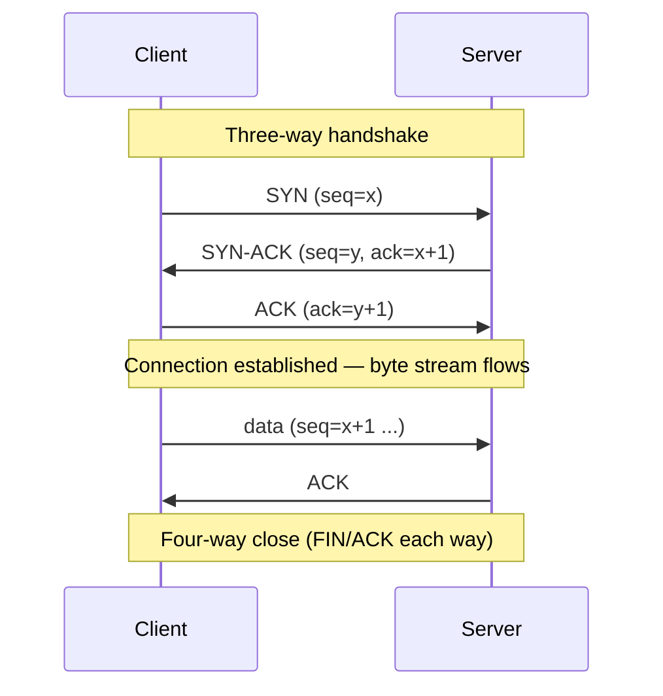

# TCP — Transmission Control Protocol

> A connection-oriented transport that turns the unreliable packet network into a reliable, ordered byte stream between two endpoints.

---

## What is it?

**TCP** is the transport protocol that guarantees your bytes arrive, in order, exactly once. The underlying network (IP) can lose, duplicate, delay, or reorder packets; TCP hides all of that. You open a connection, write a stream of bytes at one end, and read the same stream — in the same order — at the other.

It is the workhorse of the internet: HTTP/1.1 and HTTP/2, TLS, SSH, database wire protocols, and most messaging brokers all run on TCP.

## Why does it matter?

TCP gives application developers a simple, powerful abstraction — a reliable pipe — so they don't have to reinvent retransmission, ordering, and flow control. That reliability is why you can send a 10 MB response and trust every byte arrives intact without writing a single line of error-recovery code.

The cost is latency and overhead: a connection requires a handshake before any data flows, and reliability machinery (acknowledgements, retransmission, congestion control) adds round-trips and can stall a stream when a single packet is lost. Knowing this explains a lot of higher-level behavior and tells you when a lighter transport ([UDP](udp.md)) or a modern one ([QUIC](quic.md)) is the better fit.

## How it works

**Connection-oriented.** Before any data, the two peers establish a connection with a **three-way handshake**, then tear it down when done. Each side tracks sequence numbers so bytes can be ordered and acknowledged.



Key mechanisms:

- **Reliability** — every byte is acknowledged; unacknowledged data is retransmitted after a timeout.
- **Ordering** — sequence numbers let the receiver reassemble the stream in order even if packets arrive out of order.
- **Flow control** — a sliding *receive window* stops a fast sender from overwhelming a slow receiver.
- **Congestion control** — algorithms (Reno, CUBIC, BBR) back off when the network shows loss, sharing bandwidth fairly.
- **Head-of-line blocking** — because the stream must be delivered in order, one lost packet stalls delivery of everything behind it until it is retransmitted. This is a fundamental TCP property and the reason [QUIC](quic.md) exists.

## Examples

A minimal TCP echo server and client. The server accepts a connection and echoes back whatever it reads; the client connects, sends a line, and prints the reply. All four use their standard library's socket API.

### Go

```go
// Server
ln, _ := net.Listen("tcp", ":9000")
for {
    conn, _ := ln.Accept()
    go func(c net.Conn) {
        defer c.Close()
        io.Copy(c, c) // echo: copy the read stream back to the write stream
    }(conn)
}

// Client
conn, _ := net.Dial("tcp", "localhost:9000")
defer conn.Close()
conn.Write([]byte("hello\n"))
reply, _ := bufio.NewReader(conn).ReadString('\n')
fmt.Print(reply) // "hello"
```

### TypeScript (Node.js)

```ts
import net from "node:net";

// Server
net.createServer((socket) => {
  socket.pipe(socket); // echo the byte stream back
}).listen(9000);

// Client
const client = net.connect(9000, "localhost", () => {
  client.write("hello\n");
});
client.on("data", (data) => {
  process.stdout.write(data.toString()); // "hello"
  client.end();
});
```

### Java

```java
// Server
try (ServerSocket server = new ServerSocket(9000)) {
    while (true) {
        Socket socket = server.accept();
        new Thread(() -> {
            try (socket; var in = socket.getInputStream(); var out = socket.getOutputStream()) {
                in.transferTo(out); // echo
            } catch (IOException ignored) {}
        }).start();
    }
}

// Client
try (Socket socket = new Socket("localhost", 9000)) {
    socket.getOutputStream().write("hello\n".getBytes());
    var reader = new BufferedReader(new InputStreamReader(socket.getInputStream()));
    System.out.println(reader.readLine()); // "hello"
}
```

### C#

```csharp
using System.Net;
using System.Net.Sockets;

// Server
var listener = new TcpListener(IPAddress.Any, 9000);
listener.Start();
while (true)
{
    var client = await listener.AcceptTcpClientAsync();
    _ = Task.Run(async () =>
    {
        using var stream = client.GetStream();
        await stream.CopyToAsync(stream); // echo
    });
}

// Client
using var tcp = new TcpClient();
await tcp.ConnectAsync("localhost", 9000);
using var s = tcp.GetStream();
await s.WriteAsync("hello\n"u8.ToArray());
var buffer = new byte[64];
int read = await s.ReadAsync(buffer);
Console.Write(Encoding.UTF8.GetString(buffer, 0, read)); // "hello"
```

## When to use

- Anything that requires **all the data to arrive intact and in order**: web pages, API responses, file transfers, database queries.
- As the transport under higher-level protocols — HTTP/1.1, HTTP/2, TLS, gRPC (over HTTP/2), most message brokers.
- When simplicity of reasoning matters more than shaving milliseconds — the reliable-pipe abstraction removes an entire class of bugs.

## When NOT to use

- **Real-time media and telemetry** where a late packet is worthless — a retransmitted video frame arrives too late to display. Prefer [UDP](udp.md).
- **Many independent streams over one connection** where head-of-line blocking hurts — prefer [QUIC](quic.md)/HTTP/3.
- **Ultra-low-overhead, high-frequency fire-and-forget** messages (some game state, discovery) where the handshake and per-connection state are too costly.

## References

- [IETF RFC 9293 — Transmission Control Protocol (TCP)](https://www.rfc-editor.org/rfc/rfc9293) — the current consolidated specification.
- Stevens, W. Richard. *TCP/IP Illustrated, Volume 1: The Protocols*. Addison-Wesley — the classic deep dive.
- [MDN — TCP](https://developer.mozilla.org/en-US/docs/Glossary/TCP) — a concise glossary entry with links.
